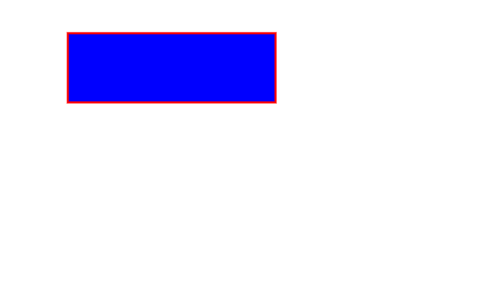
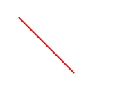
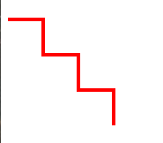
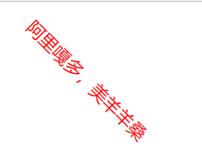
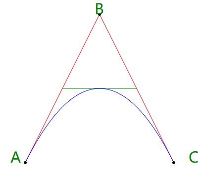
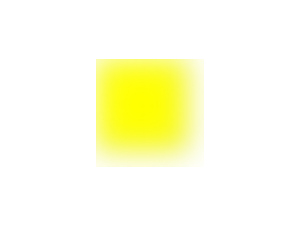
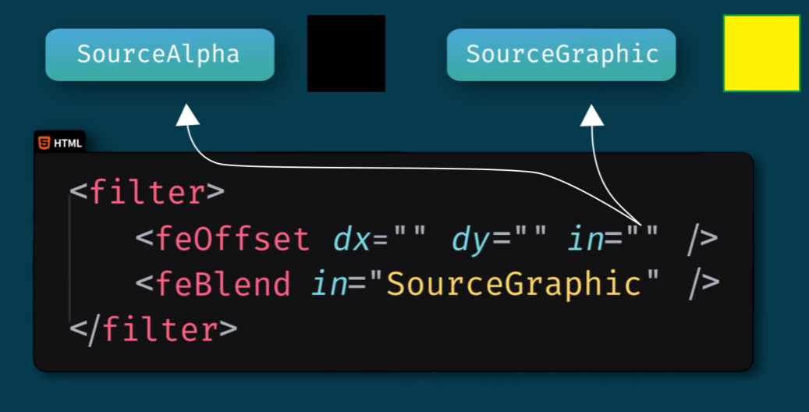
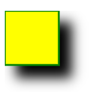
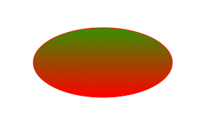
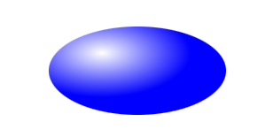

::: tip 介绍
svg基本学习，了解常用绘图标签
:::

<!-- more -->

# svg学习

**SVG标签是SVG图形的一个容器**


## 1.绘制矩形,圆形,椭圆形

1. **矩形rect**
2. **圆形circle**
3. **椭圆ellipse**
4. **线条line**
5. **多线条polyline**
6. **多边形polygon**
7. **路径path**


### 矩形rect



```html
<rect width="" height="" fill="" stroke="" stroke-width=""/>
```

#### 属性

**width:定义矩形的宽度**

**height:定义矩形的高度**

**fill:定义矩形的填充颜色**

**stroke-width:定义了矩形的边框宽度**

**stroke:定义矩形边框的颜色**

**fill-opacity:定义填充不透明度**

**stroke-opacity:定义线框不透明度**

**x，y:定位**

**rx,ry:分别设置水平垂直方向的圆角**


#### 例子：


```html
<svg width="400" height="400">
      <rect
        x="50"
        y="50"
        width="200"
        height="150"
        fill="red"
        stroke="green"
        stroke-width="5"
        rx="20"
        ry="20"
      />
    </svg>
```


### 圆形circle


```html
<svg>
      <circle
        cx="55"
        cy="55"
        r="50"
        fill="purple"
        stroke-width="3"
        stroke="gray"
      ></circle>
    </svg>
```


#### 属性

**cx:定义圆形中心的x坐标**

**cy:定义圆形中心的y坐标**

**r:定义圆形的半径**


### 椭圆形ellipse


```html
<svg width="400" height="400">
      <ellipse
        cx="100"
        cy="100"
        rx="50"
        ry="30"
        stroke="red"
        fill="white"
      ></ellipse>
    </svg>
```

#### 属性

**cx:定义椭圆中心的X坐标**

**cy:定义椭圆中心的y坐标**

**rx:定义水平半径**

**ry:定义垂直半径**

#### 例子


```html
<svg width="500" height="150">
        <ellipse cx="240" cy="100" rx="220" ry="30" fill="orange"></ellipse>
        <ellipse cx="220" cy="100" rx="170" ry="20" fill="white"></ellipse>
    </svg>
```


## 2.线条、多边型和多线条

### 线条line



```html
<svg width="200" height="200">
      <line
        x1="20"
        y1="20"
        x2="100"
        y2="100"
        stroke="red"
        stroke-width="2"
      ></line>
```

### 多边形polygon


```html
<svg width="500" height="210">
      <polygon
        points="100,10 40,198 198,78 10,78 160,198"
        fill="lime"
        stroke="red"
        stroke-width="2"
      ></polygon>
    </svg>
```

**points属性：点坐标集，空格分隔表示不同点，逗号分隔表示x,y**


### 多线条polyline



```html
<svg width="500" height="180">
      <polyline
        points="0,40 40,40 40,80 80,80 80,120 120,120 120,160"
        fill="none"
        stroke="red"
        stroke-width="4"
      ></polyline>
    </svg>
```


## 3.文本



```html
 <svg width="200" height="200">
      <text transform="rotate(45 50,50)" x="10" y="50" font-size="20" fill="red">阿里嘎多，美羊羊桑</text>
    </svg>
```

### tspan


```html
<svg width="400" height="400">
        <text x="10" y="20" fill="red">
            Several lines
            <tspan x="10" y="45">
                First line
            </tspan>
            <tspan x="10" y="70">
                Second line
            </tspan>
        </text>
    </svg>
```

**tspan相当于小text**


### 给文本加超链接


```html
<svg width="200" height="30" xmlns:xlink="https://www.w3.org/1999/xlink">
        <a target="_blank" xlink:href="http://www.baidu.com">
            <text x="10" y="15" fill="green">
                百度一下
            </text>
        </a>
</svg>
```


## 4.路径


```html
<svg width="400" height="500">
      <path d="M150 0 L75 200 L225 200"></path>
    </svg>
```


### 属性

**d:命令+点**

**大写绝对定位，小写相对起点的相对定位**

**M(moveto),L(lineto),Q(贝塞尔曲线)**

### 例子



```html
<svg width="450" height="400">
        <path d="M 100 350 l 150 -300" stroke="red"></path>
        <path d="M 250 50 l 150 300" stroke="red"></path>
        <path d="M 175 200 l 150 0" stroke="green"></path>
        <!-- q命令绘制二次贝塞尔曲线 两个控制点 -->
        <path d="M 100 350 q 150 -300 300 0" stroke="blue" fill="none"></path>
        <!-- g:group可以给一组设置公共属性 -->
      <g fill="black">
        <circle cx="100" cy="350" r="3" />
        <circle cx="250" cy="50" r="3" />
        <circle cx="400" cy="350" r="3" />
      </g>
      <g font-size="30" fill="green">
        <text x="100" y="350" dx="-30">A</text>
        <text x="250" y="50" dx="-10">B</text>
        <text x="400" y="350" dx="30">C</text>
      </g>
    </svg>
```

### 绘制虚线


```html
<svg width="300" height="800">
        <g fill="none" stroke-width="4" stroke="black">
            <path stroke-dasharray="5,5" d="M20 20 l150 0"></path>
            <path stroke-dasharray="10,10" d="M20 40 l150 0"></path>
            <path stroke-dasharray="20,10,5,5,5,10" d="M20 60 l150 0"></path>
        </g>
    </svg>
```


## 5.模糊阴影



```html
<svg width="400" height="400">
        <!-- 设置阴影 -->
        <defs>
            <filter x="0" y="0" id="f1">
                <feGaussianBlur stdDeviation="15"></feGaussianBlur>
            </filter>
        </defs>
      <rect
        x="100"
        y="100"
        width="90"
        height="90"
        stroke="green"
        stroke-width="2"
        fill="yellow"
        filter="url(#f1)"
      ></rect>
    </svg>
```

### 阴影





```html
<svg width="400" height="400">
      <defs>
        <filter x="0" y="0" width="200" height="200" id="f2">
          <feOffset in="SourceAlpha" dx="20" dy="20" fill="red"></feOffset>
          <feGaussianBlur stdDeviation="10"></feGaussianBlur>
          <feBlend in="SourceGraphic"></feBlend>
        </filter>
      </defs>

      <rect
        width="90"
        height="90"
        stroke="green"
        fill="yellow"
        stroke-width="3"
        filter="url(#f2)"
      ></rect>
    </svg>
```


## 6.渐变



```html
<svg width="400" height="400">
      <defs>
        <linearGradient id="f1" x1="0%" y1="0%" x2="0%" y2="100%">
          <stop offset="0%" stop-color="rgb(55,144,0)"></stop>
          <stop offset="100%" stop-color="rgb(255,0,0)"></stop>
        </linearGradient>
      </defs>
      <ellipse
        fill="url(#f1)"
        cx="200"
        cy="200"
        rx="100"
        ry="50"
        stroke="red"
      ></ellipse>
    </svg>
```

### 径向渐变




```html
<svg width="500" height="400">
        <defs>
            <!-- fx,fy定义里面的圆，cx,cy,r定义外面的圆形 -->
            <radialGradient id="f2" cx="30%" cy="30%" r="50%" fx="30%" fy="30%">
                <stop offset="0%" stop-color="white"></stop>
                <stop offset="100%" stop-color="blue"></stop>
            </radialGradient>
        </defs>
        <ellipse fill="url(#f2)" cx="200" cy="200" rx="100" ry="50" ></ellipse>
    </svg>
```

