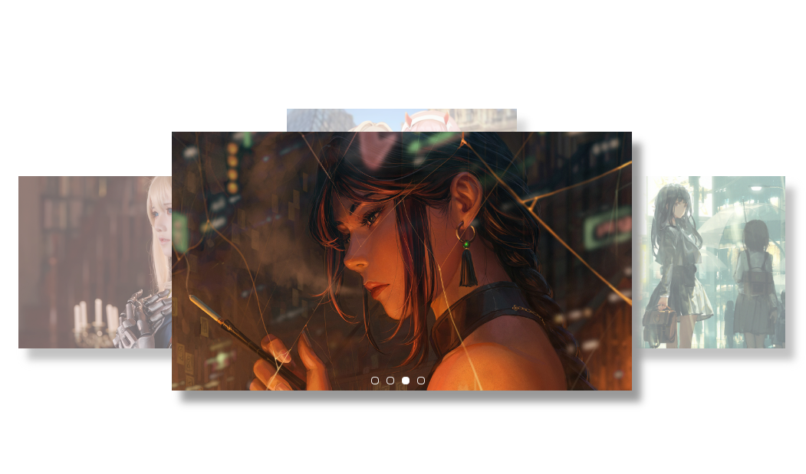

::: tip 介绍
学习三种轮播图的基本逻辑
:::

<!-- more -->

# 轮播图

完整的轮播图主要有三部分组成

1. 指示器
2. 图片
3. 点击事件


## Fade轮播图

**基本思想是把所以图片叠到一起，通过显示与隐藏切换轮播图**


### 1.先创建基本结构

```html
<!DOCTYPE html>
<html lang="en">
  <head>
    <meta charset="UTF-8" />
    <link rel="icon" type="image/svg+xml" href="/vite.svg" />
    <meta name="viewport" content="width=device-width, initial-scale=1.0" />
    <title>Vite + TS</title>
  </head>
  <body>
    <div class="carousel" id="carousel-fade">
      <div class="img-stage">
        <!-- 单个图片容器 -->
        <div class="img-wrapper animate__animated">
          
        </div>
        <div class="img-wrapper animate__animated">
          
        </div>
        <div class="img-wrapper animate__animated">
          
        </div>
        <div class="img-wrapper animate__animated">
          
        </div>
      </div>
      <!-- 指示器容器 -->
      <div class="indicator">
        <i class="dot"></i>
        <i class="dot"></i>
        <i class="dot"></i>
        <i class="dot"></i>
      </div>
    </div>
    <script type="module" src="/src/main.ts"></script>
  </body>
</html>

```

**基本的轮播图只需要两个主要结构，展示的图片和指示器，当然也可以扩展两边的上/下一张**

### 2.样式美化结构

```less
#carousel-fade {
  width: 500px;
  height: 282px;
  margin: 0 auto;
  position: relative;

  .img-stage{
    position: relative;
    .img-wrapper{
      position: absolute;
      top: 0;
      left: 0;
    }
  }

  .indicator{
    position: absolute;
    z-index: 1;
    left: 50%;
    bottom: 10px;
    width: 80px;
    height: 20px;
    transform: translate(-50%,0);
    display: flex;
    justify-content: space-between;
    .dot{
      display: block;
      width: 20px;
      height: 20px;
      position: relative;

      &::before{
        content: '';
        display: block;
        position: absolute;
        left: 50%;
        top: 50%;
        transform: translate(-50%,-50%);
        border: 1px solid #ededed;
        width: 8px;
        height: 8px;
        border-radius: 4px;
        cursor: pointer;
      }

      &.active::before{
        background-color: white;
      }
    }
  }
}

```

### 3.控制器

```typescript
import "./fade.less";
import "animate.css";
interface IOptions {
  defaultIndex: number;
  duration: number;
}

export class Fade {
  public $el: HTMLElement;
  //选择器选中的列表是NodeListOf类型
  public $imgWrappers: NodeListOf<HTMLDivElement>;
  public $dotWrapper: HTMLDivElement;
  public $dots: NodeListOf<HTMLElement>;
  public duration: number;

  private _index: number;

  static t: number;

  constructor(el: string, options: IOptions) {
    this.$el = document.querySelector(el)!;
    //获取图片容器
    this.$imgWrappers = this.$el.querySelectorAll(".img-wrapper");
    //获取点容器
    this.$dotWrapper = this.$el.querySelector(".indicator")!;
    //获取单个指示器
    this.$dots = this.$dotWrapper.querySelectorAll(".dot");
    //索引
    this._index = options.defaultIndex;
    this.duration = options.duration;
    this.init();
  }

  //代理模式
  get currentIndex() {
    return this._index;
  }

  set currentIndex(newValue: number) {
    this.update(() => {
      this._index = newValue;
    });
  }

  //初始化
  init() {
    this.show(true);
    //绑定点击事件
    this.bindEvent();
    this.play();
  }

  //显示当前图片
  show(isInitial: boolean = false) {
    //如果是初始化给每一项添加动画
    if (isInitial) {
      for (let i = 0; i < this.$imgWrappers.length; i++) {
        this.$imgWrappers[i].classList.add("animate__fadeOut");
      }
    }

    //给类添加active
    this.$imgWrappers[this.currentIndex].classList.remove("animate__fadeOut");
    this.$imgWrappers[this.currentIndex].classList.add("animate__fadeIn");
    this.$dots[this.currentIndex].classList.add("active");
  }

  //隐藏图片
  hide() {
    this.$imgWrappers[this.currentIndex].classList.remove("animate__fadeIn");
    this.$dots[this.currentIndex].classList.remove("active");
    this.$imgWrappers[this.currentIndex].classList.add("animate__fadeOut");
  }

  //播放轮播图
  play() {
    Fade.t = setInterval(() => {
      this.currentIndex >= this.$imgWrappers.length - 1
        ? (this.currentIndex = 0)
        : this.currentIndex++;
    }, this.duration);
  }

  //更新方法
  update(setIndex: () => void) {
    this.hide();
    setIndex();
    this.show();
  }

  //绑定事件
  bindEvent() {
    this.$el.addEventListener(
      "mouseenter",
      this.handleMouseEnter.bind(this),
      false
    );
    this.$el.addEventListener(
      "mouseleave",
      this.handleMouseLeave.bind(this),
      false
    );
    this.$dotWrapper.addEventListener(
      "click",
      this.handleDotClick.bind(this),
      false
    );
  }

  handleMouseEnter() {
    //鼠标移入就停止自动轮播
    clearInterval(Fade.t);
  }

  handleMouseLeave() {
    //鼠标移出就开始播放
    this.play();
  }

  handleDotClick(e: MouseEvent) {
		//先判断当前点击的是不是指示器，如果是就更改当前索引为点击的索引值
    (e.target as HTMLElement).className === "dot" &&
      (this.currentIndex = ([] as any[]).indexOf.call(this.$dots, e.target));
  }
}

```


#### 总结

封装的时候用了代理模式，每次修改currentIndex的时候会自动调用update方法。


## Slide轮播图

**基本思想是把所有图片铺到一张上，复制第一张到末尾，通过滑动切换图片**

**基本结构与Fade轮播图一致**


### 1.slide.css

```less
#carousel-slide {
    width: 500px;
    height: 282px;
    margin: 0 auto;
    position: relative;
    overflow: hidden;
    
    .img-stage{
      position: relative;
      left: 0;
      top: 0;
      width: 2500px;
      height: 100%;
      display: flex;
      overflow: hidden;
      .img-wrapper{
        width: 500px;
        height: 282px;
      }
    }
  
    .indicator{
      position: absolute;
      z-index: 1;
      left: 50%;
      bottom: 10px;
      width: 80px;
      height: 20px;
      transform: translate(-50%,0);
      display: flex;
      justify-content: space-between;
      .dot{
        display: block;
        width: 20px;
        height: 20px;
        position: relative;
  
        &::before{
          content: '';
          display: block;
          position: absolute;
          left: 50%;
          top: 50%;
          transform: translate(-50%,-50%);
          border: 1px solid #ededed;
          width: 8px;
          height: 8px;
          border-radius: 4px;
          cursor: pointer;
        }
  
        &.active::before{
          background-color: white;
        }
      }
    }
  }
  
```

### 2.控制器

```typescript
import "./slide.less";

interface IOptions {
  defaultIndex: number;
  duration: number;
}

export class Slide {
  public $el: HTMLElement;
  public $imgStage: HTMLElement;
  public $imgWrappers: NodeListOf<HTMLElement>;
  public $dotWrapper: HTMLDivElement;
  public $dots: NodeListOf<HTMLElement>;

  public duration: number;
  public imgWidth: number;
  private _index: number;

  static t: number;

  constructor(el: string, options: IOptions) {
    this.$el = document.querySelector(el)!;
    this.$imgStage = this.$el.querySelector(".img-stage")!;
    this.$imgWrappers = this.$el.getElementsByClassName('img-wrapper') as any;
    this.$dotWrapper = this.$el.querySelector(".indicator")!;
    this.$dots = this.$dotWrapper.querySelectorAll(".dot");
    this.imgWidth = this.$imgWrappers[0].offsetWidth;

    this._index = options.defaultIndex;
    this.duration = options.duration;

    this.init();
  }

  get currentIndex() {
    return this._index;
  }

  set currentIndex(newValue) {
    this.update(() => {
      this._index = newValue;
    },false);
  }

  init() {
    //先克隆一份
    this.clone();
    this.update(null,true)
    //绑定事件
    this.bindEvent();
    this.play();
  }
  //克隆方法
  clone() {
    const firstNode = this.$imgWrappers[0];
    const cloneNode = firstNode.cloneNode(true);
    firstNode.parentNode?.appendChild(cloneNode);
  }

  bindEvent() {
    this.$el.addEventListener(
      "mouseenter",
      this.handleMouseEnter.bind(this),
      false
    );
    this.$el.addEventListener(
      "mouseleave",
      this.handleMouseLeave.bind(this),
      false
    );
    this.$dotWrapper.addEventListener(
      "click",
      this.handleDotClick.bind(this),
      false
    );
  }

  handleMouseEnter() {
    clearInterval(Slide.t);
  }

  handleMouseLeave() {
    this.play();
  }

  handleDotClick(e: MouseEvent) {
    (e.target as HTMLElement).className === "dot" &&
      (this.currentIndex = ([] as any[]).indexOf.call(this.$dots, e.target));

    //点击时也要执行slide
    this.slide()
  }
  //只需要改变指示器
  update(setIndex: (() => void)|null,isInitial:boolean) {
    let currentIndex:number;
    if(!isInitial){
        currentIndex=this.currentIndex>=this.$imgWrappers.length-1?0:this.currentIndex;
        this.$dots[currentIndex].classList.remove('active')
        setIndex && setIndex()
    }
    currentIndex=this.currentIndex>=this.$imgWrappers.length-1?0:this.currentIndex;
    this.$dots[currentIndex].classList.add('active')
  }

  play() {
    Slide.t = setInterval(() => {
      this.currentIndex++;
      this.slide();
      if (this.currentIndex >= this.$imgWrappers.length - 1) {
        this.currentIndex = 0;
        //重置
        this.reset();
      }
    }, this.duration);
  }

  slide() {
    //通过css transform进行切换
    this.$imgStage.style.transition = "transform .3s ease 0s";
    this.$imgStage.style.transform = `translate3d(${
      -this.currentIndex * this.imgWidth
    }px,0,0)`;
  }

  reset() {
    //等待最后一个动画完成瞬间设置第一张图
    setTimeout(() => {
      this.$imgStage.style.transition = "none";
      this.$imgStage.style.transform = `translate3d(0,0,0)`;
    },300);
  }
}

```


## 抽离封装

**利用抽象父类把以上两个轮播图类的共同属性封装起来，然后通过静态方法创建子类。**

### carousel.ts

```typescript

interface IOptions {
  defaultIndex: number;
  duration: number;
}

export abstract class Carousel {
  public $el!: HTMLElement;
  //选择器选中的列表是NodeListOf类型
  public $imgWrappers!: NodeListOf<HTMLDivElement>;
  public $dotWrapper!: HTMLDivElement;
  public $dots!: NodeListOf<HTMLElement>;

  static t: number;

  constructor(el: string) {
    this.$el = document.querySelector(el)!;
    //获取图片容器
    this.$imgWrappers = this.$el.getElementsByClassName("img-wrapper") as any;
    //获取点容器
    this.$dotWrapper = this.$el.querySelector(".indicator")!;
    //获取单个指示器
    this.$dots = this.$dotWrapper.querySelectorAll(".dot");
  }

  //绑定事件
  bindEvent() {
    this.$el.addEventListener(
      "mouseenter",
      this.handleMouseEnter.bind(this),
      false
    );
    this.$el.addEventListener(
      "mouseleave",
      this.handleMouseLeave.bind(this),
      false
    );
    this.$dotWrapper.addEventListener(
      "click",
      this.handleDotClick.bind(this),
      false
    );
  }

  abstract handleMouseEnter(): void;

  abstract handleMouseLeave(): void;

  abstract handleDotClick(e: MouseEvent): void;

  static create(
    el: string,
    options: IOptions & {
      type?: "fade" | "slide";
    }
  ) {
    switch (options.type) {
      case "fade":
        //动态导入
        return import("./fade/fade").then((res) => new res.Fade(el, options));
      case "slide":
        return import("./slide/slide").then((res) => new res.Slide(el, options));
      default:
        return import("./fade/fade").then((res) => new res.Fade(el, options));
    }
  }
}

```


### fade.ts

```typescript
import "./fade.less";
import "animate.css";
import { Carousel } from "../carousel";
interface IOptions {
  defaultIndex: number;
  duration: number;
}

export class Fade extends Carousel {
  public duration!: number;

  private _index!: number;

  constructor(el: string, options: IOptions) {
    super(el)
    //索引
    this._index = options.defaultIndex;
    this.duration = options.duration;
    this.init();
  }

  //代理模式
  get currentIndex() {
    return this._index;
  }

  set currentIndex(newValue: number) {
    this.update(() => {
      this._index = newValue;
    });
  }

  //初始化
  init() {
    this.show(true);
    //绑定点击事件
    this.bindEvent();
    this.play();
  }

  //显示当前图片
  show(isInitial: boolean = false) {
    //如果是初始化给每一项添加动画
    if (isInitial) {
      for (let i = 0; i < this.$imgWrappers.length; i++) {
        this.$imgWrappers[i].classList.add("animate__fadeOut");
      }
    }

    //给类添加active
    this.$imgWrappers[this.currentIndex].classList.remove("animate__fadeOut");
    this.$imgWrappers[this.currentIndex].classList.add("animate__fadeIn");
    this.$dots[this.currentIndex].classList.add("active");
  }

  //隐藏图片
  hide() {
    this.$imgWrappers[this.currentIndex].classList.remove("animate__fadeIn");
    this.$dots[this.currentIndex].classList.remove("active");
    this.$imgWrappers[this.currentIndex].classList.add("animate__fadeOut");
  }

  //播放轮播图
  play() {
    Fade.t = setInterval(() => {
      this.currentIndex >= this.$imgWrappers.length - 1
        ? (this.currentIndex = 0)
        : this.currentIndex++;
    }, this.duration);
  }

  //更新方法
  update(setIndex: () => void) {
    this.hide();
    setIndex();
    this.show();
  }

  

  handleMouseEnter() {
    //鼠标移入就停止自动轮播
    clearInterval(Fade.t);
  }

  handleMouseLeave() {
    //鼠标移出就开始播放
    this.play();
  }

  handleDotClick(e: MouseEvent) {
		//先判断当前点击的是不是指示器，如果是就更改当前索引为点击的索引值
    (e.target as HTMLElement).className === "dot" &&
      (this.currentIndex = ([] as any[]).indexOf.call(this.$dots, e.target));
  }
}

```


### slide.ts

```typescript
import { Carousel } from "../carousel";
import "./slide.less";

interface IOptions {
  defaultIndex: number;
  duration: number;
}

export class Slide extends Carousel {

  public $imgStage: HTMLElement;


  public duration: number;
  public imgWidth: number;
  private _index: number;

  static t: number;

  constructor(el: string, options: IOptions) {
    super(el);
    
    this.$imgStage = this.$el.querySelector(".img-stage")!;
    this.imgWidth = this.$imgWrappers[0].offsetWidth;

    this._index = options.defaultIndex;
    this.duration = options.duration;

    this.init();
  }

  get currentIndex() {
    return this._index;
  }

  set currentIndex(newValue) {
    this.update(() => {
      this._index = newValue;
    },false);
  }

  init() {
    //先克隆一份
    this.clone();
    this.update(null,true)
    //绑定事件
    this.bindEvent();
    this.play();
  }
  //克隆方法
  clone() {
    const firstNode = this.$imgWrappers[0];
    const cloneNode = firstNode.cloneNode(true);
    firstNode.parentNode?.appendChild(cloneNode);
  }


  handleMouseEnter() {
    clearInterval(Slide.t);
  }

  handleMouseLeave() {
    this.play();
  }

  handleDotClick(e: MouseEvent) {
    (e.target as HTMLElement).className === "dot" &&
      (this.currentIndex = ([] as any[]).indexOf.call(this.$dots, e.target));

    //点击时也要执行slide
    this.slide()
  }
  //只需要改变指示器
  update(setIndex: (() => void)|null,isInitial:boolean) {
    let currentIndex:number;
    if(!isInitial){
        currentIndex=this.currentIndex>=this.$imgWrappers.length-1?0:this.currentIndex;
        this.$dots[currentIndex].classList.remove('active')
        setIndex && setIndex()
    }
    currentIndex=this.currentIndex>=this.$imgWrappers.length-1?0:this.currentIndex;
    this.$dots[currentIndex].classList.add('active')
  }

  play() {
    Slide.t = setInterval(() => {
      this.currentIndex++;
      this.slide();
      if (this.currentIndex >= this.$imgWrappers.length - 1) {
        this.currentIndex = 0;
        //重置
        this.reset();
      }
    }, this.duration);
  }

  slide() {
    //通过css transform进行切换
    this.$imgStage.style.transition = "transform .3s ease 0s";
    this.$imgStage.style.transform = `translate3d(${
      -this.currentIndex * this.imgWidth
    }px,0,0)`;
  }

  reset() {
    //等待最后一个动画完成瞬间设置第一张图
    setTimeout(() => {
      this.$imgStage.style.transition = "none";
      this.$imgStage.style.transform = `translate3d(0,0,0)`;
    },300);
  }
}

```


### main.ts

```typescript
import { Carousel } from './core/carousel'
import { Slide } from './core/slide/slide'
import './style.css'

/* new Slide('#carousel-slide',{
    defaultIndex:0,
    duration:3000
}) */

Carousel.create('#carousel-slide',{
    type:'slide',
    defaultIndex:0,
    duration:3000
})
```


## 总结

虽然这两个轮播图比较好用，封装的也还可以，但通用性不大，不能自定义图片宽高，且结构样式不能复用。


## 3D轮播图

**使用分层定位，设置阴影透明度展示3d效果，通过切换类的方式让轮播图转起来**



### 1.结构

**结构上跟普通轮播图没区别**

```html
<!DOCTYPE html>
<html lang="en">
<head>
    <meta charset="UTF-8">
    <meta http-equiv="X-UA-Compatible" content="IE=edge">
    <meta name="viewport" content="width=device-width, initial-scale=1.0">
    <title>Document</title>
</head>
<body>
    <div class="slider-3d" id="ThreeSlider">
        <div  class="img-stage">
            <div class="slider-item first">
                <a href="#">
                    
                </a>
            </div>
            <div class="slider-item second right">
                <a href="#">
                    
                </a>
            </div>
            <div class="slider-item third">
                <a href="#">
                    
                </a>
            </div>
            <div class="slider-item second left">
                <a href="#">
                    
                </a>
            </div>
        </div>
        <!-- 指示器容器 -->
        <div class="indicator">
            <i class="dot"></i>
            <i class="dot"></i>
            <i class="dot"></i>
            <i class="dot"></i>
        </div>
    </div>
    <script src="/src/main2.ts" type="module"></script>
</body>
</html>
```

### 2.样式

样式主要就是通过transform改变图片位置，形成3d视觉效果

```less
//样式上，分层定位加盒子阴影，透明度表现3d效果

.slider-3d{
    position: relative;
    width: 1000px;
    height: 500px;
    margin: 100px auto;
}

.slider-item{
    position: absolute;
    box-shadow: 12px 15px 10px #999;
    &.first{
        //第一层的宽度
        width: 600px;
        z-index: 3;
        //位置偏移
        /* top: 80px;
        left: 200px; */
        transform: translate(200px,80px);
    }

    &.second{
        //第二层
        z-index: 2;
        /* top: 138px; */
        width: 400px;

        opacity: 0.6;
        &.left{
            /* left: 0; */
            transform: translate(0,138px);
        }
        &.right{
            /* left: 600px; */
            transform: translate(600px,138px);
        }
    }

    &.third{
        //第三层
        z-index: 1;
        width: 300px;
        opacity: 0.4;

        /* top: 50px;
        left: 350px; */
        transform: translate(350px,50px);
    }

    //过渡动画
    transition: 0.6s linear;
}

.indicator{
    position: absolute;
    width: 80px;
    height: 20px;
    bottom: 80px;
    left: 50%;
    transform: translate(-50%,0);
    z-index: 4;
    display: flex;
    .dot{
        display: block;
        width: 20px;
        height: 20px;
        position: relative;
        cursor: pointer;
        &::before{
            content: '';
            width: 8px;
            height: 8px;
            border: 1px solid #ededed;
            position: absolute;
            border-radius: 4px;
        }

        &.active::before{
            background-color: white;
        }
    }
}
```

### 3.控制器

**通过保存初始化的类列表，然后根据currentIndex切换类名**

```typescript
import "./3dCarousel.less";
interface IOptions {
  defaultIndex: number;
  duration: number;
}
export class ThreeSlider {
  public $el: HTMLElement;
  public $imgWrappers!: NodeListOf<HTMLDivElement>;
  public $dotWrapper!: HTMLDivElement;
  public $dots!: NodeListOf<HTMLElement>;
  public classNames: string[] = [];
  public originalClassNames: string[] = [];
  public duration: number;
  public _index: number;
  static t: number;

  constructor(el: string, option: IOptions) {
    this.$el = document.querySelector(el)!;
    this.$imgWrappers = this.$el.querySelectorAll(".slider-item");
    this.$dotWrapper = this.$el.querySelector(".indicator")!;
    this.$dots = this.$dotWrapper.querySelectorAll(".dot");
    this._index = option.defaultIndex;

    this.duration = option.duration;
    this.init();
  }

  get currentIndex() {
    return this._index;
  }

  set currentIndex(newValue) {
    this.update(() => {
      this._index = newValue;
    });
  }

  init() {
    this.collectClassName();
    this.$dots[this.currentIndex].classList.add("active");
    this.bindEvent();
    this.play();
  }

  collectClassName() {
    let oSliderItem: HTMLDivElement;

    for (let i = 0; i < this.$imgWrappers.length; i++) {
      oSliderItem = this.$imgWrappers[i];
      this.originalClassNames.push(oSliderItem.className);
    }
  }

  setClassNames() {
      //核心代码
    this.classNames=this.originalClassNames.slice(this.currentIndex)
    this.classNames.push(...this.originalClassNames.slice(0,this.currentIndex))
    
    this.render();
  }

  play() {
    ThreeSlider.t = setInterval(() => {
      if (this.currentIndex >= this.$imgWrappers.length - 1) {
        this.currentIndex = 0;
      } else {
        this.currentIndex++;
      }
    }, this.duration);
  }

  render() {
    let oSliderItem: HTMLDivElement;

    for (let i = 0; i < this.$imgWrappers.length; i++) {
      oSliderItem = this.$imgWrappers[i];
      oSliderItem.className = this.classNames[i];
    }
  }

  bindEvent() {
    this.$el.addEventListener(
      "mouseenter",
      this.handleMouseEnter.bind(this),
      false
    );
    this.$el.addEventListener(
      "mouseleave",
      this.handleMouseLeave.bind(this),
      false
    );
    this.$dotWrapper.addEventListener(
      "click",
      this.handleDotClick.bind(this),
      false
    );
  }

  handleMouseEnter() {
    //鼠标移入就停止自动轮播
    clearInterval(ThreeSlider.t);
  }

  handleMouseLeave() {
    //鼠标移出就开始播放
    this.play();
  }

  handleDotClick(e: MouseEvent) {
    //先判断当前点击的是不是指示器，如果是就更改当前索引为点击的索引值
    (e.target as HTMLElement).className === "dot" &&
      (this.currentIndex = ([] as any[]).indexOf.call(this.$dots, e.target));
  }

  show() {
    this.$dots[this.currentIndex].classList.add("active");
  }

  hide() {
    this.$dots[this.currentIndex].classList.remove("active");
  }

  update(setIndex: () => void) {
    this.hide();
    setIndex();
    this.show();

    this.setClassNames();
  }
}

```


## 总结

**上面三种轮播图的核心是通过currentIndex进行切换，点击指示器切换主要就是改变currentIndex的值。**

**html,css,js缺一不可，后续得多加强js的练习**