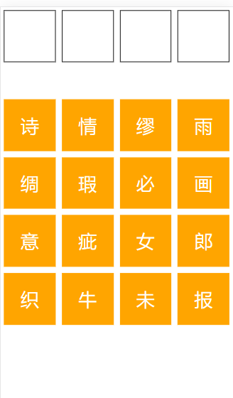
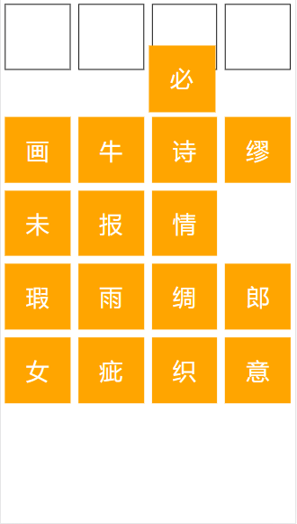
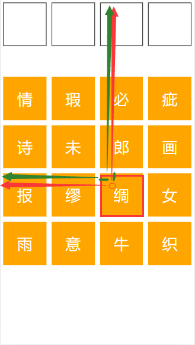

::: tip 介绍
学习移动端拖拽和吸附的基本逻辑
:::

<!-- more -->

# 拖拽和吸附

## 1.基本结构

```html
<!DOCTYPE html>
<html lang="en">
  <head>
    <meta charset="UTF-8" />
    <link rel="icon" type="image/svg+xml" href="/vite.svg" />
    <meta name="viewport" content="width=device-width, initial-scale=1.0" />
    <title>Vite + TS</title>
  </head>
  <body>
    <div id="app">
      <div class="container">
        <!-- 顶部空白盒子 -->
        <div class="blank-ceil-group">
          <div class="ceil-item">
            <div class="wrapper"></div>
          </div>
          <div class="ceil-item">
            <div class="wrapper"></div>
          </div>
          <div class="ceil-item">
            <div class="wrapper"></div>
          </div>
          <div class="ceil-item">
            <div class="wrapper"></div>
          </div>
        </div>

        <div class="char-ceil-group">
          
        </div>
      </div>
    </div>
    <script type="module" src="/src/main.ts"></script>
  </body>
</html>

```

## 2.样式

```css
*{
  margin: 0;
  padding: 0;
}

div{
  display: flex;
  flex-direction: column;
}

.blank-ceil-group,.char-ceil-group{
  width: 100%;
  flex-direction: row;
}

.char-ceil-group{
  flex-wrap: wrap;
  margin-top: 5rem;
}

.blank-ceil-group .ceil-item,
.char-ceil-group .ceil-item{
  width: 25%;
  /* 设置高度为宽度的25% */
  height: 25vw;
  padding: 0.5rem;
  box-sizing: border-box;
}

.blank-ceil-group .ceil-item .wrapper,
.char-ceil-group .ceil-item .wrapper{
  width: 100%;
  height: 100%;
  border: 0.1rem solid black;
  box-sizing: border-box;
}

.char-ceil-group .ceil-item .wrapper{
  border: none;
  background-color: orange;
  font-size: 3rem;
  justify-content: center;
  align-items: center;
  color: white;
}
```

**用百分比布局结合flex很巧妙**

## 3.渲染



```typescript
import "./style.css";

document.documentElement.style.fontSize =
  document.documentElement.clientWidth / 37.5 + "px";

// ['诗情画意'，'未雨绸缪','瑕疵必报','斤斤计较']

const idioms = ["诗情画意", "未雨绸缪", "瑕疵必报", "牛郎织女"];

//一定要思路清晰，逻辑清晰
class IdiomGame {
  public idioms: string[];
  public charsArray!: string[];
  public charCeilGroup:HTMLElement;

  constructor(idioms: string[]) {
    this.idioms = idioms;
    this.charCeilGroup=document.querySelector('.char-ceil-group')!

    this.init();
  }

  //1.基本架子搭建好

  //对元素idiom转换成随机乱序单字
  formatCharsArray() {
    this.charsArray = this.idioms.join("").split("");
    this.charsArray.sort(this.randomSort);
  }

  init() {
    this.formatCharsArray();
    this.render()
  }
  //随机函数
  randomSort(a: string, b: string) {
    return Math.random() > 0.5 ? -1 : 1;
  }
  //模板
  charCeilTpl(char: string, index: number) {
    return `<div class="ceil-item" data-index="${index}">
    <div class="wrapper">${char}</div>
    </div>`;
  }

  //渲染函数
  render(){
    let list=''
    this.charsArray.forEach((value,index)=>{
      list+=this.charCeilTpl(value,index)
    })

    this.charCeilGroup.innerHTML=list
  }

  //2.
}

new IdiomGame(idioms);

```


**添加适配方案，rem，在375px屏幕下，1rem等于10px。**

**写代码的时候一定要思路逻辑清晰，先怎么样，后怎么样，不要搞混了**


## 4.拖动



```typescript
import "./style.css";

document.documentElement.style.fontSize =
  document.documentElement.clientWidth / 37.5 + "px";

// ['诗情画意'，'未雨绸缪','瑕疵必报','斤斤计较']

const idioms = ["诗情画意", "未雨绸缪", "瑕疵必报", "牛郎织女"];

//一定要思路清晰，逻辑清晰
class IdiomGame {
  public idioms: string[];
  public charsArray!: string[];
  public charCeilGroup: HTMLElement;
  public charWrappers!: NodeListOf<HTMLElement>;

  public startX = 0;
  public startY = 0;
  public ceilW = 0;
  public ceilH = 0;
  public ceilX = 0;
  public ceilY = 0;
  public mouseX = 0;
  public mouseY = 0;

  constructor(idioms: string[]) {
    this.idioms = idioms;
    this.charCeilGroup = document.querySelector(".char-ceil-group")!;
    this.init();
  }

  //1.基本架子搭建好

  //对元素idiom转换成随机乱序单字
  formatCharsArray() {
    this.charsArray = this.idioms.join("").split("");
    this.charsArray.sort(this.randomSort);
  }

  init() {
    this.formatCharsArray();
    this.render();

    this.charWrappers = this.charCeilGroup.querySelectorAll(".wrapper");
    this.bindEvent();
  }
  //随机函数
  randomSort(a: string, b: string) {
    return Math.random() > 0.5 ? -1 : 1;
  }
  //模板
  charCeilTpl(char: string, index: number) {
    return `<div class="ceil-item" data-index="${index}">
    <div class="wrapper">${char}</div>
    </div>`;
  }

  //渲染函数
  render() {
    let list = "";
    this.charsArray.forEach((value, index) => {
      list += this.charCeilTpl(value, index);
    });

    this.charCeilGroup.innerHTML = list;
  }

  //2.处理绑定事件
  bindEvent() {
    let charItem;
    //给每个wrapper绑定事件
    for (let i = 0; i < this.charWrappers.length; i++) {
      charItem = this.charWrappers[i];
      charItem.addEventListener(
        "touchstart",
        this.handleTouchStart.bind(this),
        false
      );
      charItem.addEventListener(
        "touchmove",
        this.handleTouchMove.bind(this),
        false
      );
      charItem.addEventListener(
        "touchend",
        this.handleTouchEnd.bind(this),
        false
      );
    }
  }
	//拖动开始
  handleTouchStart(e: TouchEvent) {
    const _element = e.target as HTMLElement;
    //单元格原本的宽高
    this.ceilW = _element.offsetWidth;
    this.ceilH = _element.offsetHeight;
    //单元格离原点的位置
    this.ceilX = _element.offsetLeft;
    this.ceilY = _element.offsetTop;
    //鼠标点击的位置
    this.startX = e.touches[0].clientX;
    this.startY = e.touches[0].clientY;

    //计算鼠标离单元格边框的位置
    this.mouseX = this.startX - this.ceilX;
    this.mouseY = this.startY - this.ceilY;

    //转换成rem单位
    _element.style.width = this.ceilW / 10 + "rem";
    _element.style.height = this.ceilH / 10 + "rem";
    _element.style.position = "fixed";
    _element.style.left = this.ceilX / 10 + "rem";
    _element.style.top = this.ceilY / 10 + "rem";
  }
	//移动
  handleTouchMove(e: TouchEvent) {
    e.preventDefault();

    const moveX = e.touches[0].clientX,
      moveY = e.touches[0].clientY;

    this.ceilX=moveX-this.mouseX;
    this.ceilY=moveY-this.mouseY;

    (e.target as HTMLElement).style.left=this.ceilX/10+'rem';
    (e.target as HTMLElement).style.top=this.ceilY/10+'rem';

  }

  handleTouchEnd(e: TouchEvent) {}
}

new IdiomGame(idioms);

```



**当拖动开始时主要是确定鼠标点击位置离单元格边框的位置，确定后开始移动时根据鼠标位置，计算出单元格的位置，保持单元格跟鼠标保持相对静止，设置单元格的位置为fixed固定定位，这样就能设置拖动效果。**


## 5.回弹

```typescript
import "./style.css";

document.documentElement.style.fontSize =
  document.documentElement.clientWidth / 37.5 + "px";

// ['诗情画意'，'未雨绸缪','瑕疵必报','斤斤计较']

const idioms = ["诗情画意", "未雨绸缪", "瑕疵必报", "牛郎织女"];

//一定要思路清晰，逻辑清晰
class IdiomGame {
  public idioms: string[];
  public charsArray!: string[];
  public charCeilGroup: HTMLElement;
  public charWrappers!: NodeListOf<HTMLElement>;

  public blankWrappers!: NodeListOf<HTMLElement>;

  public startX = 0;
  public startY = 0;
  public ceilW = 0;
  public ceilH = 0;
  public ceilX = 0;
  public ceilY = 0;
  public mouseX = 0;
  public mouseY = 0;

  //字的初始位置
  public charAreas:{startX:number,startY:number}[]=[];
  //顶部空白格初始位置
  public blankAreas:{startX:number,startY:number}[]=[];

  //保存结果
  public resArray=[];
  
  constructor(idioms: string[]) {
    this.idioms = idioms;
    this.charCeilGroup = document.querySelector(".char-ceil-group")!;
    this.blankWrappers=document.querySelectorAll('.blank-ceil-group .wrapper')
    this.init();
  }

  //1.基本架子搭建好

  //对元素idiom转换成随机乱序单字
  formatCharsArray() {
    this.charsArray = this.idioms.join("").split("");
    this.charsArray.sort(this.randomSort);
  }

  init() {
    this.formatCharsArray();
    this.render();

    this.charWrappers = this.charCeilGroup.querySelectorAll(".wrapper");
    this.getAreas(this.charWrappers,this.charAreas)
    this.getAreas(this.blankWrappers,this.blankAreas)

    console.log(this.blankAreas)
    this.bindEvent();
  }
  //随机函数
  randomSort(a: string, b: string) {
    return Math.random() > 0.5 ? -1 : 1;
  }
  //模板
  charCeilTpl(char: string, index: number) {
    return `<div class="ceil-item" >
    <div class="wrapper" data-index="${index}">${char}</div>
    </div>`;
  }

  //渲染函数
  render() {
    let list = "";
    this.charsArray.forEach((value, index) => {
      list += this.charCeilTpl(value, index);
    });

    this.charCeilGroup.innerHTML = list;
  }

  //2.处理绑定事件
  bindEvent() {
    let charItem;
    //给每个wrapper绑定事件
    for (let i = 0; i < this.charWrappers.length; i++) {
      charItem = this.charWrappers[i];
      charItem.addEventListener(
        "touchstart",
        this.handleTouchStart.bind(this),
        false
      );
      charItem.addEventListener(
        "touchmove",
        this.handleTouchMove.bind(this),
        false
      );
      charItem.addEventListener(
        "touchend",
        this.handleTouchEnd.bind(this),
        false
      );
    }
  }

  handleTouchStart(e: TouchEvent) {
    const _element = e.target as HTMLElement;
    //单元格原本的宽高
    this.ceilW = _element.offsetWidth;
    this.ceilH = _element.offsetHeight;
    //单元格离原点的位置
    this.ceilX = _element.offsetLeft;
    this.ceilY = _element.offsetTop;
    //鼠标点击的位置
    this.startX = e.touches[0].clientX;
    this.startY = e.touches[0].clientY;

    //计算鼠标离单元格边框的位置
    this.mouseX = this.startX - this.ceilX;
    this.mouseY = this.startY - this.ceilY;

    //转换成rem单位
    _element.style.width = this.ceilW / 10 + "rem";
    _element.style.height = this.ceilH / 10 + "rem";
    _element.style.position = "fixed";
    _element.style.left = this.ceilX / 10 + "rem";
    _element.style.top = this.ceilY / 10 + "rem";
  }

  handleTouchMove(e: TouchEvent) {
    e.preventDefault();

    const moveX = e.touches[0].clientX,
      moveY = e.touches[0].clientY;

    this.ceilX=moveX-this.mouseX;
    this.ceilY=moveY-this.mouseY;

    (e.target as HTMLElement).style.left=this.ceilX/10+'rem';
    (e.target as HTMLElement).style.top=this.ceilY/10+'rem';

  }

  handleTouchEnd(e: TouchEvent) {
    //从dataset获取对应的索引，然后取出初始位置，再给当前元素重新设置为初始位置
    const _index=+(e.target as HTMLElement).dataset.index!;
    (e.target as HTMLElement).style.left=this.charAreas[_index].startX/10+'rem';
    (e.target as HTMLElement).style.top=this.charAreas[_index].startY/10+'rem';
  

  }

  //获取容器刚开始的位置
  getAreas(domCollection:NodeListOf<HTMLElement>,areas:any[]){
    let startX=0,startY=0,oItem;
    for(let i=0;i<domCollection.length;i++){
      oItem=domCollection[i];
      startX=oItem.offsetLeft;
      startY=oItem.offsetTop;

      areas.push({
        startX,
        startY
      })
    }
  }
}

new IdiomGame(idioms);

```


**保存容器初始的位置，当拖动结束的时候，通过dataset取出索引值，然后找到对应的初始位置，然后重新设置回去就能实现回弹效果。**


## 6.吸附


```typescript
import "./style.css";

document.documentElement.style.fontSize =
  document.documentElement.clientWidth / 37.5 + "px";

// ['诗情画意'，'未雨绸缪','瑕疵必报','斤斤计较']

const idioms = ["诗情画意", "未雨绸缪", "瑕疵必报", "牛郎织女"];

//一定要思路清晰，逻辑清晰
class IdiomGame {
  public idioms: string[];
  public charsArray!: string[];
  public charCeilGroup: HTMLElement;
  public charWrappers!: NodeListOf<HTMLElement>;

  public blankWrappers!: NodeListOf<HTMLElement>;

  public startX = 0;
  public startY = 0;
  public ceilW = 0;
  public ceilH = 0;
  public ceilX = 0;
  public ceilY = 0;
  public mouseX = 0;
  public mouseY = 0;

  //字的初始位置
  public charAreas: { startX: number; startY: number }[] = [];
  //顶部空白格初始位置
  public blankAreas: { startX: number; startY: number }[] = [];

  //保存结果
  public resArray: { char: string; el: HTMLElement }[] = [];

  constructor(idioms: string[]) {
    this.idioms = idioms;
    this.charCeilGroup = document.querySelector(".char-ceil-group")!;
    this.blankWrappers = document.querySelectorAll(
      ".blank-ceil-group .wrapper"
    );
    this.init();
  }

  //1.基本架子搭建好

  //对元素idiom转换成随机乱序单字
  formatCharsArray() {
    this.charsArray = this.idioms.join("").split("");
    this.charsArray.sort(this.randomSort);
  }

  init() {
    this.formatCharsArray();
    this.render();

    this.charWrappers = this.charCeilGroup.querySelectorAll(".wrapper");
    this.getAreas(this.charWrappers, this.charAreas);
    this.getAreas(this.blankWrappers, this.blankAreas);

    console.log(this.blankAreas);
    this.bindEvent();
  }
  //随机函数
  randomSort(a: string, b: string) {
    return Math.random() > 0.5 ? -1 : 1;
  }
  //模板
  charCeilTpl(char: string, index: number) {
    return `<div class="ceil-item" >
    <div class="wrapper" data-index="${index}">${char}</div>
    </div>`;
  }

  //渲染函数
  render() {
    let list = "";
    this.charsArray.forEach((value, index) => {
      list += this.charCeilTpl(value, index);
    });

    this.charCeilGroup.innerHTML = list;
  }

  //2.处理绑定事件
  bindEvent() {
    let charItem;
    //给每个wrapper绑定事件
    for (let i = 0; i < this.charWrappers.length; i++) {
      charItem = this.charWrappers[i];
      charItem.addEventListener(
        "touchstart",
        this.handleTouchStart.bind(this),
        false
      );
      charItem.addEventListener(
        "touchmove",
        this.handleTouchMove.bind(this),
        false
      );
      charItem.addEventListener(
        "touchend",
        this.handleTouchEnd.bind(this),
        false
      );
    }
  }

  handleTouchStart(e: TouchEvent) {
    const _element = e.target as HTMLElement;
    //单元格原本的宽高
    this.ceilW = _element.offsetWidth;
    this.ceilH = _element.offsetHeight;
    //单元格离原点的位置
    this.ceilX = _element.offsetLeft;
    this.ceilY = _element.offsetTop;
    //鼠标点击的位置
    this.startX = e.touches[0].clientX;
    this.startY = e.touches[0].clientY;

    //计算鼠标离单元格边框的位置
    this.mouseX = this.startX - this.ceilX;
    this.mouseY = this.startY - this.ceilY;

    //转换成rem单位
    _element.style.width = this.ceilW / 10 + "rem";
    _element.style.height = this.ceilH / 10 + "rem";
    _element.style.position = "fixed";
    _element.style.left = this.ceilX / 10 + "rem";
    _element.style.top = this.ceilY / 10 + "rem";
  }

  handleTouchMove(e: TouchEvent) {
    e.preventDefault();

    const moveX = e.touches[0].clientX,
      moveY = e.touches[0].clientY;

    this.ceilX = moveX - this.mouseX;
    this.ceilY = moveY - this.mouseY;

    (e.target as HTMLElement).style.left = this.ceilX / 10 + "rem";
    (e.target as HTMLElement).style.top = this.ceilY / 10 + "rem";
  }

  handleTouchEnd(e: TouchEvent) {
    //获取blankCeil宽高
    const blankWidth = this.blankWrappers[0].offsetWidth;
    const blankHeight = this.blankWrappers[0].offsetHeight;

    for (let i = 0; i < this.blankAreas.length; i++) {
      if (this.resArray[i] !== undefined) {
        continue;
      }

      let { startX, startY } = this.blankAreas[i];

      //对比（最核心部分）
      //单元格的原点位置要大于空白格的原始位置，小于宽高的一半
      //就是超过50%就能进去
      if (
        (this.ceilX > startX &&
          this.ceilX < startX + blankWidth / 2 &&
          this.ceilY > startY &&
          this.ceilY < startY + blankHeight / 2) ||
        (this.ceilX + blankWidth > startX + blankWidth / 2 &&
          this.ceilX + blankWidth < startX + blankWidth &&
          this.ceilY > startY &&
          this.ceilY < startY + blankHeight / 2)
      ) {
        //设置到空白格位置
        this.setPosition(e.target as any,{startX,startY})
        return;
      }
    }

    //从dataset获取对应的索引，然后取出初始位置，再给当前元素重新设置为初始位置
    const _index = +(e.target as HTMLElement).dataset.index!;
    this.setPosition(e.target as any,this.charAreas[_index])
    
  }

  //获取容器刚开始的位置
  getAreas(domCollection: NodeListOf<HTMLElement>, areas: any[]) {
    let startX = 0,
      startY = 0,
      oItem;
    for (let i = 0; i < domCollection.length; i++) {
      oItem = domCollection[i];
      startX = oItem.offsetLeft;
      startY = oItem.offsetTop;

      areas.push({
        startX,
        startY,
      });
    }
  }

  //设置位置
  setPosition(el:HTMLElement,{startX,startY}){
    el.style.left=startX/10+'rem';
    el.style.top=startY/10+'rem';
  }
}

new IdiomGame(idioms);

```

**吸附的主要逻辑就是在拖动结束后判断字的原点位置是否是在空白单元格的50%，如果在就设置成空白格的初始位置**


## 7.检查

```typescript
import "./style.css";

document.documentElement.style.fontSize =
  document.documentElement.clientWidth / 37.5 + "px";

// ['诗情画意'，'未雨绸缪','瑕疵必报','斤斤计较']

const idioms = ["诗情画意", "未雨绸缪", "瑕疵必报", "牛郎织女"];

//一定要思路清晰，逻辑清晰
class IdiomGame {
  public idioms: string[];
  public charsArray!: string[];
  public charCeilGroup: HTMLElement;
  public charWrappers!: NodeListOf<HTMLElement>;

  public blankWrappers!: NodeListOf<HTMLElement>;

  public startX = 0;
  public startY = 0;
  public ceilW = 0;
  public ceilH = 0;
  public ceilX = 0;
  public ceilY = 0;
  public mouseX = 0;
  public mouseY = 0;

  //字的初始位置
  public charAreas: { startX: number; startY: number }[] = [];
  //顶部空白格初始位置
  public blankAreas: { startX: number; startY: number }[] = [];

  //保存结果
  public resArray: { char: string; el: HTMLElement }[] =Array(4).fill(undefined);

  constructor(idioms: string[]) {
    this.idioms = idioms;
    this.charCeilGroup = document.querySelector(".char-ceil-group")!;
    this.blankWrappers = document.querySelectorAll(
      ".blank-ceil-group .wrapper"
    );
    this.init();
  }

  //1.基本架子搭建好

  //对元素idiom转换成随机乱序单字
  formatCharsArray() {
    this.charsArray = this.idioms.join("").split("");
    this.charsArray.sort(this.randomSort);
  }

  init() {
    this.formatCharsArray();
    this.render();

    this.charWrappers = this.charCeilGroup.querySelectorAll(".wrapper");
    this.getAreas(this.charWrappers, this.charAreas);
    this.getAreas(this.blankWrappers, this.blankAreas);

    console.log(this.blankAreas);
    this.bindEvent();
  }
  //随机函数
  randomSort() {
    return Math.random() > 0.5 ? -1 : 1;
  }
  //模板
  charCeilTpl(char: string, index: number) {
    return `<div class="ceil-item" >
    <div class="wrapper" data-index="${index}">${char}</div>
    </div>`;
  }

  //渲染函数
  render() {
    let list = "";
    this.charsArray.forEach((value, index) => {
      list += this.charCeilTpl(value, index);
    });

    this.charCeilGroup.innerHTML = list;
  }

  //2.处理绑定事件
  bindEvent() {
    let charItem;
    //给每个wrapper绑定事件
    for (let i = 0; i < this.charWrappers.length; i++) {
      charItem = this.charWrappers[i];
      charItem.addEventListener(
        "touchstart",
        this.handleTouchStart.bind(this),
        false
      );
      charItem.addEventListener(
        "touchmove",
        this.handleTouchMove.bind(this),
        false
      );
      charItem.addEventListener(
        "touchend",
        this.handleTouchEnd.bind(this),
        false
      );
    }
  }

  handleTouchStart(e: TouchEvent) {
    const _element = e.target as HTMLElement;
    //单元格原本的宽高
    this.ceilW = _element.offsetWidth;
    this.ceilH = _element.offsetHeight;
    //单元格离原点的位置
    this.ceilX = _element.offsetLeft;
    this.ceilY = _element.offsetTop;
    //鼠标点击的位置
    this.startX = e.touches[0].clientX;
    this.startY = e.touches[0].clientY;

    //计算鼠标离单元格边框的位置
    this.mouseX = this.startX - this.ceilX;
    this.mouseY = this.startY - this.ceilY;

    //转换成rem单位
    _element.style.width = this.ceilW / 10 + "rem";
    _element.style.height = this.ceilH / 10 + "rem";
    _element.style.position = "fixed";

    /* _element.style.left = this.ceilX / 10 + "rem";
    _element.style.top = this.ceilY / 10 + "rem"; */

    this.setPosition(_element,{startX:this.ceilX,startY:this.ceilY})
  }

  handleTouchMove(e: TouchEvent) {
    e.preventDefault();

    const moveX = e.touches[0].clientX,
      moveY = e.touches[0].clientY;

    this.ceilX = moveX - this.mouseX;
    this.ceilY = moveY - this.mouseY;

    this.setPosition(e.target as HTMLElement,{startX:this.ceilX,startY:this.ceilY})
  }

  handleTouchEnd(e: TouchEvent) {
    //获取blankCeil宽高
    const blankWidth = this.blankWrappers[0].offsetWidth;
    const blankHeight = this.blankWrappers[0].offsetHeight;

    for (let i = 0; i < this.blankAreas.length; i++) {
      if (this.resArray[i] !== undefined) {
        continue;
      }

      let { startX, startY } = this.blankAreas[i];

      //对比（最核心部分）
      //单元格的原点位置要大于空白格的原始位置，小于宽高的一半
      //就是超过50%就能进去
      if (
        (this.ceilX > startX &&
          this.ceilX < startX + blankWidth / 2 &&
          this.ceilY > startY &&
          this.ceilY < startY + blankHeight / 2) ||
        (this.ceilX + blankWidth > startX + blankWidth / 2 &&
          this.ceilX + blankWidth < startX + blankWidth &&
          this.ceilY > startY &&
          this.ceilY < startY + blankHeight / 2)
      ) {
        //设置到空白格位置
        this.setPosition(e.target as any,{startX,startY})
        this.setResArray(e.target as any,i)

        
        /* this.resArray.length===4 */
        //如果判断长度假如第一个先不选，先填第四个会报错
        //every和some会跳过 empty
        //可以用includes检测
        if(!this.resArray.includes(undefined as any)){
          setTimeout(()=>{
            if(this.checkIdiom()===-1){
              alert('回答错误')
            }else{
              alert('正确')
            }
            //重置位置
            this.resetPosition()
          },1000)
        }
        return;
      }
    }

    //从dataset获取对应的索引，然后取出初始位置，再给当前元素重新设置为初始位置
    const _index = +(e.target as HTMLElement).dataset.index!;
    this.setPosition(e.target as any,this.charAreas[_index])
    
  }

  //获取容器刚开始的位置
  getAreas(domCollection: NodeListOf<HTMLElement>, areas: any[]) {
    let startX = 0,
      startY = 0,
      oItem;
    for (let i = 0; i < domCollection.length; i++) {
      oItem = domCollection[i];
      startX = oItem.offsetLeft;
      startY = oItem.offsetTop;

      areas.push({
        startX,
        startY,
      });
    }
  }

  //设置位置
  setPosition(el:HTMLElement,{startX,startY}){
    el.style.left=startX/10+'rem';
    el.style.top=startY/10+'rem';
  }

  //保存结果
  setResArray(el:HTMLElement,index:number){
    this.resArray[index]={
      el,
      char:el.innerText
    }
  }

  //检查结果
  checkIdiom(){
    let idiom='';
    this.resArray.forEach(i=>idiom+=i.char)

    return idioms.indexOf(idiom)
  }

  //重置位置
  resetPosition(){
    //把每一项设置为初始值
    this.resArray.forEach(item=>{
      this.setPosition(item.el,this.charAreas[+item.el.dataset.index!])
    })


    //重置初始变量
    this.resArray=Array(4).fill(undefined)
    this.startX=0;
    this.startY=0;
    this.ceilX=0;
    this.ceilY=0;
    this.mouseX=0;
    this.mouseY=0
  }
}

new IdiomGame(idioms);

```

**还有一个bug就是只能放上去，拖下来之后就不能再放上去了，原因是拖下来没把resArray当前的索引对应的值设置为undefined**

