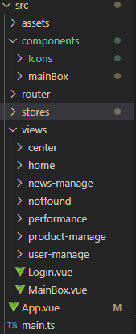
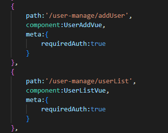
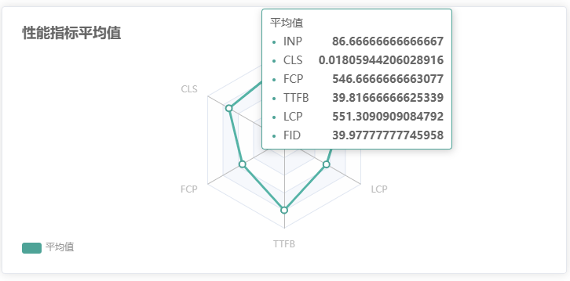
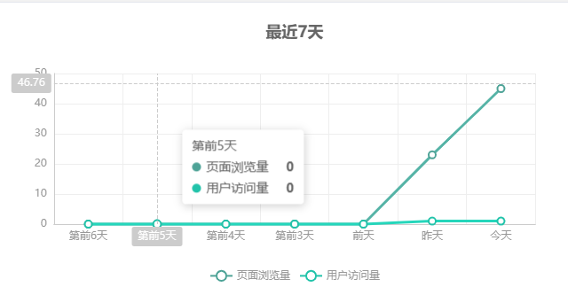

::: tip 介绍
企业门户网站管理系统后台，使用vue3+element-plus+vite+ts+echarts开发
:::

<!-- more -->

# 企业门户网站管理系统后台

项目预览：http://43.138.16.164:3000/admin

项目地址：[yexiyue/Portal-management-system: 企业门户网站管理系统 (github.com)](https://github.com/yexiyue/Portal-management-system)

## 模块设计

- 用户模块
- 新闻模块
- 产品模块
- 性能数据模块

## 目录结构



## 技术栈

- vue3
- pinia
- axios
- element-plus
- echarts


## 1.先搭好路由架子

**路由设计要合理，一级登录页面和后台主页面**

**后台主页面下动态添加子路由，对应主要的content部分，因为后台系统头部和侧边菜单栏可以复用，所以采用此设计比较合理。**

```typescript
import { useIndexStore } from "./../stores/store";
import { routesConfig } from "./config";
import {
  createRouter,
  createWebHashHistory,
} from "vue-router";
import LoginVue from "../views/Login.vue";
import MainBoxVue from "../views/MainBox.vue";
import { pinia } from "@/stores";

export const MainBox = Symbol();

const router = createRouter({
  /* history: createWebHistory(import.meta.env.BASE_URL), */
  history: createWebHashHistory(),
  routes: [
    {
      path: "/login",
      name: "login",
      component: LoginVue,
    },
    {
      path: "/mainBox",
      name: MainBox,
      component: MainBoxVue,
    },
    //mainBox的嵌套路由后面根据权限动态添加
  ],
});

//在其他地方不是在vue文件中，得传入pinia参数
const store = useIndexStore(pinia);

//路由拦截
router.beforeEach((to, from, next) => {

  if (to.name === "login") {
    next();
  } else {
    //如果授权，就通过
    //没授权，重定向到login
    if (!localStorage.getItem("token")) {
      next({
        name: "login",
        replace: true,
      });
    } else {
      //只配置一遍就可以了
      if (!store.isGetterRouter) {
        configRouter();
        //不能直接使用next()，因为路径刚刚添加好，得重新再走一遍
        next({
          path: to.fullPath,
        });
      } else {
        next();
      }
    }
  }
});

function configRouter() {
  routesConfig.forEach((item) => {
    router.addRoute(MainBox, item);
  });
  //改变第一次，让其只配置一遍
  store.isGetterRouter = true;
}

export default router;
```

```typescript
import type { RouteRecordRaw } from "vue-router";
import HomeVue from "@/views/home/Home.vue";
import CenterVue from "@/views/center/Center.vue"
import UserAddVue from "../views/user-manage/UserAdd.vue"
import UserListVue from "../views/user-manage/UserList.vue"
import NewsAddVue from "../views/news-manage/NewsAdd.vue"
import NewsListVue from "../views/news-manage/NewsList.vue"
import ProductAddVue from "../views/product-manage/ProductAdd.vue"
import ProductListVue from "../views/product-manage/ProductList.vue"
import PerformanceVue from "@/views/performance/Data.vue"
import NotFoundVue from "@/views/notfound/NotFound.vue";
//做一个列表，方便动态添加路由
export const routesConfig:RouteRecordRaw[]=[
    {
        path:'/index',
        component:HomeVue
    },
    {
        path:'/center',
        component:CenterVue
    },
    {
        path:'/user-manage/addUser',
        component:UserAddVue
    },
    {
        path:'/user-manage/userList',
        component:UserListVue
    },
    {
        path:'/news-manage/addNews',
        component:NewsAddVue
    },
    {
        path:'/news-manage/newsList',
        component:NewsListVue
    },
    {
        path:'/product-manage/addProduct',
        component:ProductAddVue
    },
    {
        path:'/product-manage/productList',
        component:ProductListVue
    },
    {
        path:'/performance',
        component:PerformanceVue
    },
    {
        path:'/',
        redirect:'/index'
    },
    //匹配错误页面
    {
        // /:表示自定义匹配
        path:'/:errorPath+',
        component:NotFoundVue
    }   
]
```

### 注意：

**在router模块中使用pinia store时由于不是在vue组件树中，所以使用时需要把pinia传入。**


## 2.登录模块粒子效果

```vue
<template>
    <div class="box">
        <Particles id="tsparticles" :particlesInit="particlesInit" :options="options" />
        <div class="form-box">
            <p>企业门户网站管理系统</p>
            <el-form ref="ruleFormRef" :rules="loginFormRules" :model="loginFrom" status-icon class="demo-ruleForm">
                <el-form-item label="用户名" prop="username">
                    <el-input v-model="loginFrom.username" autocomplete="off" />
                </el-form-item>
                <el-form-item label="账号" prop="password">
                    <el-input v-model="loginFrom.password" type="password" autocomplete="off" />
                </el-form-item>
                <el-form-item label="验证码" prop="code">
                    <el-input v-model="loginFrom.code" autocomplete="off" />
                </el-form-item>
                <div class="imgCode">
                    <div v-html="imgCode"></div>
                    <el-button type="primary" @click="refreshImgCode">点击刷新</el-button>
                </div>
                <el-form-item>
                    <el-button type="primary" @click="submitForm">Login</el-button>
                </el-form-item>
            </el-form>
        </div>
    </div>
</template>

<script setup lang="ts">
import { loadFull } from "tsparticles";
import {  reactive, ref } from "vue";
import type { FormInstance } from 'element-plus';
import { useIndexStore } from '../stores/store'
import { useRouter } from "vue-router";
import { useGetImgCode } from "@/hooks/getImgCode";
import { postLogin } from "@/api/userApi";
import { ElMessage } from 'element-plus'

const particlesInit = async (engine: any) => {
    await loadFull(engine);
};
const { imgCode, refreshImgCode } = useGetImgCode()

const store = useIndexStore()
const router = useRouter()
const ruleFormRef = ref<FormInstance>()

const loginFormRules = {
    username: [
        { required: true, message: '请输入用户名', trigger: 'blur' },
    ],
    password: [
        { required: true, message: '请输入密码', trigger: 'blur' },
    ],
    code: [
        {     required: true, message: '请输入验证码', trigger: 'blur'}
    ]
}

const loginFrom = reactive({
    username: '',
    password: '',
    code: ''
})

const submitForm = () => {
    //1.校验表单
    ruleFormRef.value?.validate(async (isValid) => {
        if (isValid) {
            //2.提交表单
            const res=await postLogin(loginFrom)
            if(res.data.success){
                //登录成功提示信息
                ElMessage.success('登录成功')
                //3.设置token,从响应头中获取token信息
                store.setToken(res.headers.authorization)
                router.push('/index')
            }
            console.log(res)
            
        }
    })
}
//配置particles的
const options = {
    background: {
        color: {
            value: 'transparent'
        }
    },
    fpsLimit: 120,
    interactivity: {
        events: {
            onClick: {
                enable: true,
                mode: 'push'
            },
            onHover: {
                enable: true,
                mode: 'repulse'
            },
            resize: true
        },
        modes: {
            bubble: {
                distance: 400,
                duration: 2,
                opacity: 0.8,
                size: 40
            },
            push: {
                quantity: 4
            },
            repulse: {
                distance: 200,
                duration: 0.4
            }
        }
    },
    particles: {
        color: {
            value: '#ffffff'
        },
        links: {
            color: '#ffffff',
            distance: 150,
            enable: true,
            opacity: 0.5,
            width: 1
        },
        collisions: {
            enable: true
        },
        move: {
            direction: 'none',
            enable: true,
            outModes: {
                default: 'bounce'
            },
            random: false,
            speed: 2,
            straight: false
        },
        number: {
            density: {
                enable: true,
                area: 800
            },
            value: 80
        },
        opacity: {
            value: 0.5
        },
        shape: {
            type: 'circle'
        },
        size: {
            value: { min: 1, max: 5 },
        }
    },
    detectRetina: true
}
</script>

<style scoped lang="less">
.box {
    height: 100%;
    background-image: url(../assets/2030824.jpg);
    background-size: cover;
    display: flex;
    align-items: center;
    justify-content: center;
}

.form-box {
    background-color: rgba(48, 47, 47, 0.322);
    width: 50%;
    padding: 10px;

    p {
        margin: 20px auto;
        text-align: center;
        color: white;
        font-size: 20px;
    }
}

/* deep选择器解决scope下 选择子组件类 */
:deep(.el-form-item__label) {
    color: white;
}

:deep(.el-button) {
    margin: 10px auto;
    width: 20%;
}

.imgCode {
    display: flex;
    align-items: center;
    justify-content: center;
    :deep(.el-button) {
        width: 20%;
        margin: 0 20px;
    }

    div {
        margin-top: 10px;
    }
}</style>
```

## 3.登录携带token

**对登录的信息进行处理，并把值保存到store中**

```typescript
import axios, { AxiosError } from "axios";
import { ElMessage } from 'element-plus'
import { useIndexStore } from "@/stores/store";
import { pinia } from "@/stores";

const store=useIndexStore(pinia)

axios.defaults.baseURL='/adminapi'

axios.interceptors.request.use((config)=>{
    //请求拦截器设置authorization
    const token=store.token
    token && (config.headers.Authorization=token)
    return config
})

axios.interceptors.response.use((value)=>{
    //响应拦截器获取token
    if(value.headers.authorization){
        store.setToken(value.headers.authorization)
    }
    return value
},(error:AxiosError)=>{
    //错误信息报错
    ElMessage.error((error.response!.data as any).message)

    if((error.response?.data as any).status==401){
        //登录过期重新登录
        location.replace('#/login')
        localStorage.removeItem('token')
    }
})
```


## 4.图片显示

```css
.avatar{
    width: 178px;
    height: 178px;
    /* 通过object-fit设置图片裁剪 */
    object-fit: cover;
    /* 通过object-position设置图片位置 */
    object-position: center;
}
```


## 5.对上传组件进行封装

**使用自定义事件和自定义v-model**

```vue
<template>
    <el-upload @change="onChangeHandle" class="avatar-uploader" :auto-upload="false" :show-file-list="false">
        
        <el-icon v-else class="avatar-uploader-icon">
            <Plus />
        </el-icon>
    </el-upload>
</template>

<script setup lang="ts">
import { Plus } from '@element-plus/icons-vue';
import type { UploadFile } from 'element-plus';
import { computed, ref } from 'vue';

//利用v-model:image-src进行双向绑定
const props=defineProps<{
    imageSrc:string
}>()
const emit=defineEmits<{
    (event:'update:imageSrc',newValue:string):void,
    (event:'Upload',file:File):void
}>()
//利用计算属性简化操作
const value=computed({
    get(){
        return props.imageSrc
    },
    set(newValue){
        emit('update:imageSrc',newValue)
    }
})

//选择头像
const onChangeHandle = (file: UploadFile) => {
    const reader = new FileReader()
    reader.readAsDataURL(file.raw!)
    reader.onload = (ev) => {
        value.value = ev.target?.result as string
    }
    //通过事件把file值传回去
    emit('Upload',file.raw!)
}

</script>

<style scoped>
:deep(.avatar-uploader .el-upload) {
    border: 1px dashed var(--el-border-color);
    border-radius: 6px;
    cursor: pointer;
    position: relative;
    overflow: hidden;
    transition: var(--el-transition-duration-fast);
}

:deep(.avatar-uploader .el-upload:hover) {
    border-color: var(--el-color-primary);
}

:deep(.el-icon.avatar-uploader-icon) {
    font-size: 28px;
    color: #8c939d;
    width: 178px;
    height: 178px;
    text-align: center;
}

.avatar {
    width: 178px;
    height: 178px;
    /* 通过object-fit设置图片裁剪 */
    object-fit: cover;
    /* 通过object-position设置图片位置 */
    object-position: center;
}
</style>
```

**编写hook进一步封装**

```typescript
import { ref } from "vue"
import { uploadImg } from '@/api';
export const useUploadImage=()=>{
    const imageFile=ref<File>()
    const onUpload=(e?:File)=>{
        imageFile.value=e
    }

    const getUploadedImageUrl=async()=>{
        if(imageFile.value){
            const imgRes = await uploadImg(imageFile.value)
            return '/images/' + imgRes.data.data
        }
    }

    return {
        onUpload,
        getUploadedImageUrl
    }
}
```


**组件使用，在center模块中进行个人信息更新**

```vue
<template>
    <el-page-header icon="" title="企业门户管理系统">
        <template #content>
            <span class="text-large font-600 mr-3">个人中心</span>
        </template>
    </el-page-header>
    <el-row :gutter="20">
        <el-col :span="8">
            <el-card class="box-card">
                <!-- 头像组件 -->
                <el-avatar :size="100"
                    :src="store.user.avatar ?? 'https://cube.elemecdn.com/e/fd/0fc7d20532fdaf769a25683617711png.png'">
                </el-avatar>
                <h3>{{ store.user.username }}</h3>
                <h5>{{ store.user.role === 1 ? '管理员' : '编辑' }}</h5>
            </el-card>
        </el-col>
        <el-col :span="15">
            <el-card>
                <template #header>
                    个人信息
                </template>
                <!-- 表单 -->
                <el-form label-width="100px" ref="userFormRef" :model="userForm" :rules="rules" class="demo-ruleForm">
                    <el-form-item label="用户名" prop="username">
                        <el-input v-model="userForm.username" />
                    </el-form-item>
                    <el-form-item label="性别" prop="gender">
                        <el-select style="width: 100%;" v-model="userForm.gender">
                            <el-option label="保秘" :value="0"></el-option>
                            <el-option label="男" :value="1"></el-option>
                            <el-option label="女" :value="2"></el-option>
                        </el-select>
                    </el-form-item>
                    <el-form-item label="简介" prop="introduction">
                        <el-input type="textarea" v-model="userForm.introduction" />
                    </el-form-item>
                    <el-form-item label="头像" prop="avatar">
                        <UploadVue v-model:image-src="userForm.avatar" @upload="onUpload" ></UploadVue>
                    </el-form-item>

                    <el-form-item>
                        <el-button @click="updateUserInfo" type="primary" class="user-form-submit">
                            更新
                        </el-button>
                    </el-form-item>
                </el-form>
            </el-card>
        </el-col>
    </el-row>
</template>

<script setup lang="ts">
import { useIndexStore,type User } from '@/stores/store';
import { reactive, ref } from 'vue';
import { ElMessage, type FormInstance } from 'element-plus';
import {  updateUser } from '@/api';
import UploadVue from '@/components/upload/Upload.vue'
import {useUploadImage} from '@/components/upload/uploadImage'
const store = useIndexStore()
const userForm = reactive<User>({
    ...store.user,
})
const userFormRef = ref<FormInstance>()
const rules = {
    username: [
        { required: true, message: '用户名不能为空', trigger: 'blur' }
    ],
    gender: [
        { required: true, message: '请选择性别', trigger: 'blur' }
    ],
    introduction: [
        { required: true, message: '请输入简介', trigger: 'blur' }
    ],
    avatar: [
        { required: true, message: '请上传头像', trigger: 'blur' }
    ],
}

//导入和Upload组件配合使用的hooks
const {onUpload,getUploadedImageUrl}=useUploadImage()

//更新个人信息
const updateUserInfo = () => {
    userFormRef.value?.validate(async (isValid) => {
        if (isValid) {
            let avatarUrl=await getUploadedImageUrl()

            const res = await updateUser(userForm.id, {
                avatar: avatarUrl,
                username: userForm.username,
                gender: userForm.gender,
                introduction: userForm.introduction
            })

            if (res.data.success) {
                ElMessage.success('更新成功')
                store.setUser(res.data.data)
            }
        }
    })
}
</script>

<style scoped>
.el-row {
    margin-top: 20px;
}

.box-card {
    text-align: center;
}

.user-form-submit {
    width: 50%;
    margin: auto;
}
</style>
```

## 6.使用v-bind()绑定css变量

```typescript
/* 使用v-bind绑定css变量动态设置高度 */
:deep(.el-main){
    height: v-bind(height);
}
```


## 7.使用自定义指令控制菜单显示

[自定义指令 | Vue.js (vuejs.org)](https://cn.vuejs.org/guide/reusability/custom-directives.html#custom-directives)

**根据用户角色删除该节点**

```typescript
const vAdmin:ObjectDirective={
    mounted(el:HTMLElement){
        if(store.user.role!==1){
            el.parentNode?.removeChild(el)
        }
    }
}
```

## 8.进行路由控制限制权限



```typescript
//路由拦截
router.beforeEach((to, from, next) => {
  if (to.name === "login") {
    next();
  } else {
    //如果授权，就通过
    //没授权，重定向到login
    if (!localStorage.getItem("token")) {
      next({
        name: "login",
        replace: true,
      });
    } else {
      //只配置一遍就可以了
      if (!store.isGetterRouter) {
        //先删除所有的嵌套路由
        router.removeRoute(MainBox);
        //重新添加路由
        if (!router.hasRoute(MainBox)) {
          router.addRoute({
            path: "/mainBox",
            name: MainBox,
            component: MainBoxVue,
          });
        }
        configRouter();
        //不能直接使用next()，因为路径刚刚添加好，得重新再走一遍
        next({
          path: to.fullPath,
        });
      } else {
        next();
      }
    }
  }
});

function configRouter() {
  routesConfig.forEach((item) => {
    checkPermission(item) && router.addRoute(MainBox, item);
  });
  //改变第一次，让其只配置一遍
  store.isGetterRouter = true;
}

//判断元数据是否需要验证角色
function checkPermission(item: RouteRecordRaw) {
  if (item.meta?.requiredAuth) {
    //如果为管理员就添加，不是就不添加
    return store.user.role === 1;
  }
  return true;
}
```


## 9.富文本编辑器

[wangEditor](https://www.wangeditor.com/)

**使用wangEditor编写新闻主体内容**

```vue
<template>
    <div style="border: 1px solid #ccc">
        <Toolbar style="border-bottom: 1px solid #ccc" :editor="editorRef" />
        <Editor @onBlur="onBlurHandler" style=" height:300px;overflow-y: hidden;" v-model="valueHtml"  @onCreated="handleCreated" />
    </div>
</template>

<script setup lang="ts">
import '@wangeditor/editor/dist/css/style.css' // 引入 css
import { onBeforeUnmount, ref, shallowRef } from 'vue'
import { Editor, Toolbar } from '@wangeditor/editor-for-vue'

const editorRef = shallowRef()

const valueHtml = ref('<p>你好呀</p>')

//组件销毁时，也及时销毁编辑器
onBeforeUnmount(() => {
    editorRef.value?.destroy()
})

const handleCreated = (editor) => {
    editorRef.value = editor // 记录 editor 实例，重要！
}

const onBlurHandler=(editor)=>{
    console.log(editor)
    console.log(valueHtml.value)
}
</script>

<style scoped></style>
```

**使用v-model双向绑定封装editor**

```vue
<template>
    <div style="border: 1px solid #ccc">
        <Toolbar style="border-bottom: 1px solid #ccc" :editor="editorRef" />
        <Editor style=" height:300px;overflow-y: hidden;" v-model="value"  @onCreated="handleCreated" />
    </div>
</template>

<script setup lang="ts">
import '@wangeditor/editor/dist/css/style.css' // 引入 css
import { computed, onBeforeUnmount, ref, shallowRef } from 'vue'
import { Editor, Toolbar } from '@wangeditor/editor-for-vue'

//进行数据双向绑定
const props=defineProps<{
    modelValue:string
}>()
const emit=defineEmits<{
    (event:'update:modelValue',newValue:string)
}>()

const value=computed({
    get(){
        return props.modelValue
    },
    set(newValue){
        emit('update:modelValue',newValue)
    }
})
const editorRef = shallowRef()

//组件销毁时，也及时销毁编辑器
onBeforeUnmount(() => {
    editorRef.value?.destroy()
})

const handleCreated = (editor) => {
    editorRef.value = editor // 记录 editor 实例，重要！
}
</script>

<style scoped></style>
```

## 10.使用echarts进行数据展示

### 1.封装echarts成单独组件

```vue
<template>
    <el-card>
        <div ref="dom" :style="{
            width,height
        }"></div>
    </el-card>
</template>

<script setup lang="ts">

import { onMounted, ref } from 'vue';
import * as  ECharts from 'echarts'
import theme from './theme.json'
const dom = ref()
const props=withDefaults(defineProps<{
    options:ECharts.EChartsOption,
    width:string,
    height:string
}>(),{
    width:'100%',
    height:'300px'
})

onMounted(async () => {
    const myECharts = ECharts.init(dom.value,theme)
    myECharts.setOption(props.options)
    window.addEventListener('resize', () => {
        myECharts.resize()
    })
})
</script>

<style scoped>
.el-card{
    margin: 20px 0;
}
</style>
```


### 2.在另一个文件写配置项

```typescript
import type { EChartsOption } from "echarts";
import { getPageView } from "@/api";

export const getOptions = async () => {
  const data2 = (await getPageView(1)).data;
  const data = (await getPageView()).data;
  const data1 = (await getPageView(30)).data;

  const set = new Set([...data[0], ...data1[0], ...data2[0]]);
  return <EChartsOption>{
    title: {
      text: "页面浏览量",
      left: "center",
    },
    xAxis: {
      data: [...set],
    },
    yAxis: {},
    series: [
      {
        name: "1天页面浏览量",
        type: "bar",
        data: data2[1],
        barMaxWidth: 30,
        barMinWidth: 10,
        markLine: {
          data: [
            {
              type: "average",
              name: "平均总页面浏览量",
            },
          ],
        },
      },
      {
        name: "7天页面浏览量",
        type: "bar",
        data: data[1],
        barMaxWidth: 30,
        barMinWidth: 10,
        markLine: {
          data: [
            {
              type: "average",
              name: "平均总页面浏览量",
            },
          ],
        },
      },
      {
        name: "30天页面浏览量",
        type: "bar",
        data: data1[1],
        barMaxWidth: 30,
        barMinWidth: 10,
        markLine: {
          data: [
            {
              type: "average",
              name: "平均总页面浏览量",
            },
          ],
        },
      },
    ],
    tooltip: {
      trigger: "axis",
      axisPointer: {
        type: "cross",
      },
    },
    legend: {
      top: "bottom",
    },
  };
};

```


### 3.进行组装使用

```vue
<template>
    <el-page-header icon="" title="数据中心">
        <template #content>
            <span class="text-large font-600 mr-3">用户浏览</span>
        </template>
    </el-page-header>
    <Suspense>
        <my-echarts :options="options"></my-echarts>
    </Suspense>
    <Suspense>
        <my-echarts :options="options1" height="300px"></my-echarts>
    </Suspense>
    <Suspense>
        <my-echarts :options="options2" height="300px"></my-echarts>
    </Suspense>
    <Suspense>
        <my-echarts :options="options3" height="300px"></my-echarts>
    </Suspense>
    <el-backtop :right="100" :bottom="100" />
</template>

<script setup lang="ts">
import MyEcharts from '@/components/echarts/MyEcharts.vue';
import { getOptions } from './echartsOptions/01-PageView'
import { getOptions2 } from './echartsOptions/02-NewsCount'
import { getOptions3 } from './echartsOptions/03-EveryPageView'

const options = await getOptions()
const { options1, options2 } = await getOptions2()

const { options3 } = await getOptions3()


</script>

<style scoped></style>
```


**使用suspense组件协调异步加载**

`<Suspense>` 是一个内置组件，用来在组件树中协调对异步依赖的处理。它让我们可以在组件树上层等待下层的多个嵌套异步依赖项解析完成，并可以在等待时渲染一个加载状态。

```vue
<template>
    <div class="common-layout">
        <!-- 主侧可复用 -->
        <el-container>
            <Aside/>
            <el-container direction="vertical">
                <TopHeader></TopHeader>
                <el-main>
                    <!-- suspense组件，当子组件有异步setup时使用 -->
                    <Suspense>
                        <router-view></router-view>
                    </Suspense>
                </el-main>
            </el-container>
        </el-container>
    </div>
</template>

<script setup lang="ts">
import TopHeader from '@/components/mainBox/TopHeader.vue';
import { onMounted, ref } from 'vue';
import Aside from '../components/mainBox/SideMenu.vue'
const height=ref('')
onMounted(()=>{
    height.value=window.innerHeight-60+'px'
    window.onresize=()=>{
        height.value=window.innerHeight-60+'px'
    }
})
</script>

<style scoped>
/* 使用v-bind绑定css变量动态设置高度 */
:deep(.el-main){
    height: v-bind(height);
}
</style>
```



