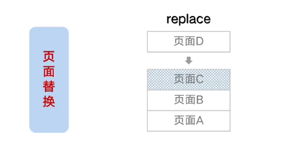
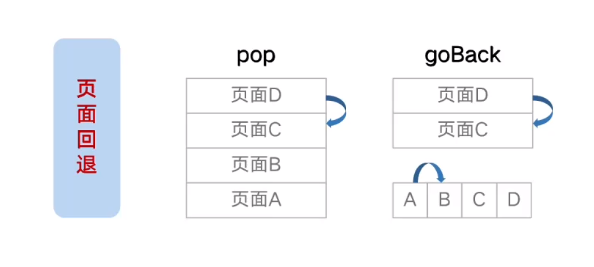

# 仿小红书app

[ react-native 首次运行慢_鲤鱼的日常生活的博客-CSDN博客](https://blog.csdn.net/liyu_ya/article/details/129403811)

查看这篇文章可解决初始构建速度慢，下载依赖慢等问题

## 1.路由管理

### 1.安装依赖

**使用pnpm软链接**

```js
const MetroSymlinkResolve = require("@rnx-kit/metro-resolver-symlinks");
module.exports = {
  transformer: {
    getTransformOptions: async () => ({
      transform: {
        experimentalImportSupport: false,
        inlineRequires: true,
      },
    }),
  },
  resolver: {
    //使用软链接导入
    resolveRequest: MetroSymlinkResolve(),
  },
};

```

**集成react-navigation**

```bash
#构建底部tab页
pnpm add @react-navigation/bottom-tabs
pnpm add @react-navigation/native
pnpm add @react-navigation/stack
#手势处理
pnpm add react-native-gesture-handler
pnpm add react-native-safe-area-context
pnpm add react-native-screens
```






### 2.构建导航栈

**在App.tsx根节点构建导航栈**

**配置导航栈属性**

**App.tsx**

**可以通过ScreenOptions或者单个路由的options设置页面跳转动画**

```tsx
import React from "react";
import { StatusBar } from "react-native";

import {SafeAreaProvider} from 'react-native-safe-area-context'
import { NavigationContainer } from "@react-navigation/native";
import { TransitionPresets, createStackNavigator } from "@react-navigation/stack";
import { PageA } from "./src/modules/PageA";
import { PageB } from "./src/modules/PageB";

const Stack=createStackNavigator()
export default function App(): JSX.Element {
  return (
    <SafeAreaProvider>
      <StatusBar barStyle="dark-content" backgroundColor="white"></StatusBar>
      {/* 整个导航栈的容器 */}
      <NavigationContainer>
        {/* 创建导航器 */}
        <Stack.Navigator 
        screenOptions={{
          /* 配置该属性解决当层级过多渲染混乱问题 */
          cardStyle:{
            elevation:1
          },
          //全局添加跳转动画
          ...TransitionPresets.SlideFromRightIOS
        }}
        initialRouteName="PageA">
          {/* 构建路由 */}
          <Stack.Screen 
          component={PageA} 
          options={{
            //不显示页头
            headerShown:false
          }}
          name="PageA" />

          <Stack.Screen 
          component={PageB} 
          options={{
            headerShown:false,
            //单个页面跳转动画
            ...TransitionPresets.ModalSlideFromBottomIOS
          }}
          name="PageB" />

        </Stack.Navigator>
      </NavigationContainer>
    </SafeAreaProvider>
  );
}

```

**PageA.tsx**

使用navigation进行路由跳转

```tsx
import {  useNavigation } from "@react-navigation/native"
import { StackNavigationProp } from "@react-navigation/stack"
import { Button, Text, View } from "react-native"

export const PageA=()=>{
    //使用泛型才可提示push
    const navigation=useNavigation<StackNavigationProp<any>>()
    return <View style={{marginTop:20,flex:1}}>
        <Text style={{fontSize:24}}>
            我是页面A
        </Text>
        <Button title="跳转到PageB" 
        onPress={()=>{
            navigation.push('PageB')
        }}
        ></Button>
    </View>
}
```


## 2.欢迎页面，登录页面