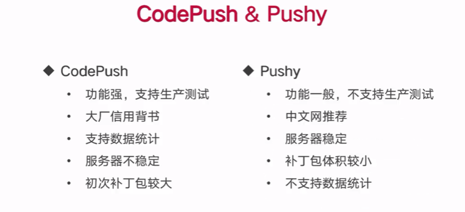
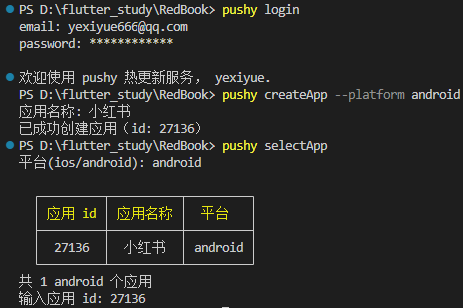
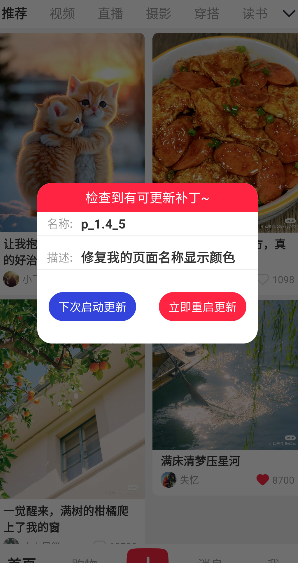

::: tip 介绍
热修复技术
:::

<!-- more -->

## 热修复

### 1.Pushy

什么是热修复技术?

- **不需要下载应用包，不需要重新发起安装**
- **小体积差分包下载、免安装重启生效**

为什么会存在热修复技术?

- 移动端的特有属性:离线安装包
- 互联网竞争的短平快新:最小成本、最快速度、降低干扰



[安装配置 - Pushy (reactnative.cn)](https://pushy.reactnative.cn/docs/getting-started.html)

```bash
# 先全局安装命令行工具，每台电脑只用装一次
npm i -g react-native-update-cli

# 然后在项目目录中安装热更新模块
npm i react-native-update
```


**根据官网配置文档一步步操作就行**




### 2.代码集成（自定义）

1. **获取appKey**
2. **下载更新**
3. **检查更新**
4. **切换版本**


**生效与回滚**

- 确认生效:补丁安装成功，保存patch版本
- 回滚补丁:补丁安装失败，上报信息

```tsx
//1.导入配置文件
import _updateConfig from '../../../update.json'
import { checkUpdate } from "react-native-update";
import { downloadUpdate } from "react-native-update";
import { switchVersion } from "react-native-update";
import { isFirstTime } from "react-native-update";
import { markSuccess } from "react-native-update";
import { isRolledBack } from "react-native-update";
//@ts-ignore
const {appKey}=_updateConfig[Platform.OS]

export const Home = () => {
  //初始请求数据
  useEffect(() => {
    requestHomeList();
    getCategoryList();
    checkPatch()

    if(isFirstTime){
      // 必须调用此更新成功标记方法
      // 否则默认更新失败，下一次启动会自动回滚
      markSuccess()
    }else if(isRolledBack){
      //补丁回滚，上报服务器信息
    }
  }, []);

  //检查补丁更新
  const checkPatch=async ()=>{
    const info=await checkUpdate(appKey)
    if(info.upToDate===false && info.expired===false){
      if(info.update){
        const hash=await downloadUpdate(
          info,
          {
            onDownloadProgress:({received,total})=>{
              console.log(received, total);
            }
          }
        )
        if(hash){
          switchVersion(hash)
        }
      }
    }
  }
}
```


### 3.解决网络问题

android9.0默认禁止访问不安全的请求，比如http。

**解决办法**

在AndroidManifest的application中添加 android:usesCleartextTraffic="true"

```xml
<manifest xmlns:android="http://schemas.android.com/apk/res/android">

    <uses-permission android:name="android.permission.INTERNET" />
    <!-- 在AndroidManifest的application中添加 android:usesCleartextTraffic="true"-->
    <application
      android:name=".MainApplication"
      android:label="@string/app_name"
      android:icon="@mipmap/ic_launcher"
      android:roundIcon="@mipmap/ic_launcher_round"
      android:allowBackup="false"
      android:usesCleartextTraffic="true"
      android:theme="@style/AppTheme">
      <activity
        android:name=".MainActivity"
        android:label="@string/app_name"
        android:configChanges="keyboard|keyboardHidden|orientation|screenLayout|screenSize|smallestScreenSize|uiMode"
        android:launchMode="singleTask"
        android:windowSoftInputMode="adjustResize"
        android:exported="true">
        <intent-filter>
            <action android:name="android.intent.action.MAIN" />
            <category android:name="android.intent.category.LAUNCHER" />
        </intent-filter>
      </activity>
    </application>
</manifest>

```


### 4.封装高阶组件

**封装高阶组件把pushy热更新抽离出来**




```tsx
import { useEffect, useState } from "react";
import {
  UpdateAvailableResult,
  checkUpdate,
  downloadUpdate,
  isFirstTime,
  isRolledBack,
  markSuccess,
  switchVersion,
  switchVersionLater,
} from "react-native-update";
import {
  Modal,
  Pressable,
  StyleSheet,
  Text,
  TouchableOpacity,
  View,
} from "react-native";
import Toast from "react-native-toast-message";
type IReactComponent =
  | React.FunctionComponent
  | React.ClassicComponentClass
  | React.ComponentClass
  | React.ForwardRefExoticComponent<any>;

export const withPushy = <T extends IReactComponent>(
  OriginComponent: T,
  appKey: string
): T => {
  const HOCValue = (props: any) => {
    useEffect(() => {
      cacheUpdate();

      if (isFirstTime) {
        // 必须调用此更新成功标记方法
        // 否则默认更新失败，下一次启动会自动回滚
        markSuccess();
        Toast.show({
          type: "success",
          text1: "更新完成",
        });
      } else if (isRolledBack) {
        Toast.show({
          type: "error",
          text1: "刚刚更新失败了,版本被回滚.",
        });
      }
    }, []);

    const [visible, setVisible] = useState(false);
    const [info, setInfo] = useState<UpdateAvailableResult>();
    const [download, setDownload] = useState(false);
    const [downloading, setDownloading] = useState(false);

    const [progress, setProgress] = useState({
      received: 0,
      total: 0,
    });
    const [hash, setHash] = useState("");

    //当进度条满的时候,设置下载成功
    useEffect(() => {
      if (progress.received >= progress.total && progress.total !== 0) {
        setDownloading(false);
        setDownload(true);
      }
    }, [progress]);

    const cacheUpdate = async () => {
      const info = await checkUpdate(appKey) as UpdateAvailableResult
      
      if (info.update) {
        //如果需要更新才显示弹窗
        setVisible(true);
        setInfo(info);
        try {
          //设置下载中
          setDownloading(true);
          const hash = await downloadUpdate(info, {
            onDownloadProgress: ({ received, total }) => {
              setProgress({ received, total });
            },
          });
          if (hash) {
            setHash(hash);
          }
        } catch (error) {
          Toast.show({
            type: "error",
            text1: JSON.stringify(error),
          });
        }
      }
    };

    const onLaterHandle = () => {
      if (hash) {
        switchVersionLater(hash);
      }
      setVisible(false);
    };

    const onImmediatelyHandle = () => {
      if (hash) {
        switchVersion(hash);
      }
      setVisible(false);
    };

    return (
      <>
        <OriginComponent {...props}></OriginComponent>
        <Modal
          animationType="fade"
          visible={visible}
          statusBarTranslucent
          transparent
        >
          <View style={styles.root}>
            <View style={styles.container}>
              <Text style={styles.title}>检查到有可更新补丁~</Text>
              <View style={styles.txtItem}>
                <Text style={styles.text}>名称:</Text>
                <Text style={styles.text2}>{info?.name}</Text>
              </View>
              <View style={styles.txtItem}>
                <Text style={styles.text}>描述:</Text>
                <Text style={styles.text2}>{info?.description}</Text>
              </View>
              {downloading && download == false && (
                <View
                  style={{
                    paddingHorizontal: 20,
                  }}
                >
                  <Text style={{
										width:'100%',
										textAlign:'center',
										color:'#333',
										fontSize:12,
										fontWeight:'bold'
									}}>下载进度:&nbsp;{(progress.received/progress.total*100).toFixed(2)}%</Text>
                </View>
              )}

              {download && downloading == false && (
                <View style={styles.buttonView}>
                  <TouchableOpacity
                    onPress={onLaterHandle}
                    style={[
                      styles.buttonItem,
                      {
                        backgroundColor: "#34d",
                      },
                    ]}
                  >
                    <Text
                      style={{
                        color: "white",
                      }}
                    >
                      下次启动更新
                    </Text>
                  </TouchableOpacity>
                  <TouchableOpacity
                    onPress={onImmediatelyHandle}
                    style={[
                      styles.buttonItem,
                      {
                        backgroundColor: "#ff2442",
                      },
                    ]}
                  >
                    <Text
                      style={{
                        color: "white",
                      }}
                    >
                      立即重启更新
                    </Text>
                  </TouchableOpacity>
                </View>
              )}
            </View>
          </View>
        </Modal>
      </>
    );
  };

  return HOCValue as T;
};

const styles = StyleSheet.create({
  root: {
    backgroundColor: "#00000090",
    justifyContent: "center",
    alignItems: "center",
    flex: 1,
  },
  container: {
    width: "70%",
    height: 200,
    backgroundColor: "white",
    borderRadius: 18,
  },
  title: {
    textAlign: "center",
    fontSize: 16,
    lineHeight: 36,
    textAlignVertical: "center",
    color: "white",
    backgroundColor: "#ff2442",
    borderTopRightRadius: 18,
    borderTopLeftRadius: 18,
  },
  txtItem: {
    flexDirection: "row",
    paddingHorizontal: 12,
    alignItems: "center",
    marginBottom: 12,
    height: 30,
    borderBottomWidth: 1,
    borderBottomColor: "#eee",
  },
  text: {
    marginRight: 10,
    fontSize: 14,
    color: "#999",
  },
  text2: {
    color: "#333",
    fontSize: 16,
    fontWeight: "bold",
  },
  total: {
    width: "100%",
    height: 20,
    backgroundColor: "#eee",
  },
  received: {
    height: "100%",
    backgroundColor: "#ff2442",
    width: "0%",
  },
  buttonView: {
    width: "100%",
    flexDirection: "row",
    alignItems: "center",
    justifyContent: "space-around",
    marginTop: 16,
  },
  buttonItem: {
    height: 36,
    borderRadius: 18,
    justifyContent: "center",
    alignItems: "center",
    paddingHorizontal: 12,
  },
});

```


### 5.常用命令

```bash
 #打release包
 ./gradlew aR
 #安装app
 adb install .\android\app\build\outputs\apk\release\app-release.apk
 #发布基准包
 pushy uploadApk .\android\app\build\outputs\apk\release\app-release.apk
 #发布补丁包
 pushy bundle --platform android
```

