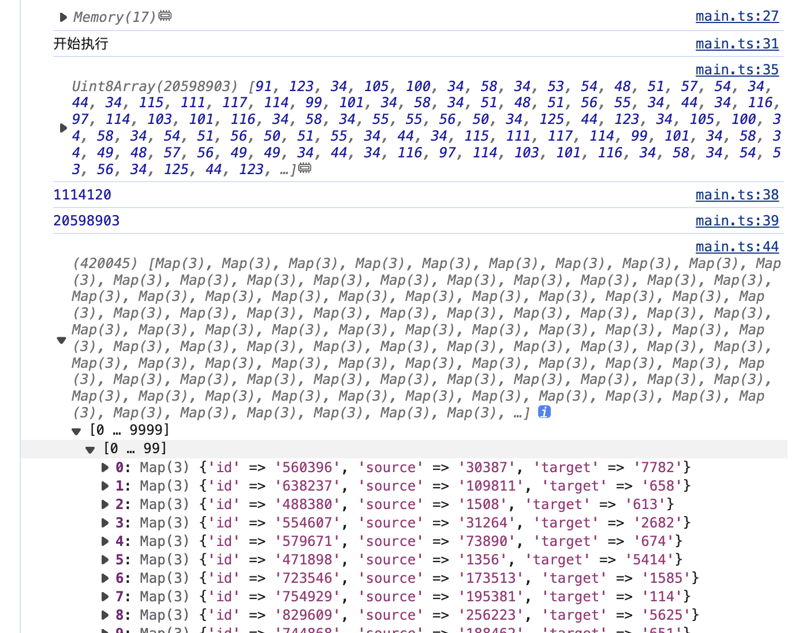

::: tip 介绍
对wasm高性能计算的探索
:::

<!-- more -->

## 对wasm高性能计算的探索

使用wasm进行大量计算确实比js快一点，但这一点并不是很满意

### 对wasm内存的读取

#### 1.在wasm中定义结构

```rust
#[derive(Debug, Deserialize, Serialize, Clone)]
pub struct Data {
    data: Vec<u8>,
}

#[wasm_bindgen]
impl Data {
    pub fn new(data: Vec<u8>) -> Self {
        Self { data }
    }
    pub fn ptr(&self) -> *const u8 {
        self.data.as_ptr()
    }
    pub fn len(&self) -> usize {
        self.data.len()
    }
}

impl Data {
    pub fn process_data(&self) -> Vec<Edge> {
        serde_json::from_slice(&self.data).unwrap()
    }
}
```

要返回数据的指针和长度，由于分配的内存是固定的，所以通过js不能直接设置data


### 2.在前端中使用和访问

```typescript
fetch("/Email_EuAll.json")
    .then(res => res.json())
    .then(data => {
      console.log("开始执行")
      
      console.time("transform to unit8array")
      const json_data = new TextEncoder().encode(JSON.stringify(data.edges))
      const wasm_data = Data.new(json_data);
      const ptr = wasm_data.ptr();
      console.log(ptr)
      console.log(wasm_data.len())
      const unit8array = new Uint8Array((v.memory as WebAssembly.Memory).buffer, wasm_data.ptr(), 				wasm_data.len())
      unit8array.set(json_data.reverse())
      
      console.log(unit8array)
      console.log(new TextDecoder().decode(unit8array))
      console.timeEnd("transform to unit8array")
      console.log(wasm_data.len())
      })
```

之后修改数据可以通过这个unit8array，但是新增数据目前还不知道有什么方案。


## 3.对wasm内存写入

```rust
#[wasm_bindgen]
#[derive(Debug, Deserialize, Serialize, Clone)]
pub struct Data {
    data: Vec<u8>,
}

#[wasm_bindgen]
impl Data {
    pub fn new(len: usize) -> Self {
        let data = vec![0; len];

        Self { data }
    }
    pub fn ptr(&self) -> *const u8 {
        self.data.as_ptr()
    }
    pub fn len(&self) -> usize {
        self.data.len()
    }
}

impl Data {
    pub fn process_data(&self) -> Vec<Edge> {
        serde_json::from_slice(&self.data).unwrap()
    }
}
```

先定义这样的数据结构,在new 的时候我们传入数据的长度，但还是不能动态增加内存

```typescript
console.time("transform to unit8array")
const json_data = new TextEncoder().encode(JSON.stringify(data.edges))
console.log(json_data)
const wasm_data = Data.new(json_data.length);
const ptr = wasm_data.ptr();
console.log(ptr)
console.log(wasm_data.len())
const unit8array = new Uint8Array((v.memory as WebAssembly.Memory).buffer, wasm_data.ptr(), wasm_data.len())
unit8array.set(json_data,0)

console.log(unit8array)

console.log(new TextDecoder().decode(unit8array))
console.timeEnd("transform to unit8array")
```

通过unit8array进行内存操作写入到memory中。

**但如何在rust中进行操作前端写入到内存的数据呢？**


## 4.在rust中操作数据

定义一个方法，用于接受Data结构体

```rust
#[wasm_bindgen]
pub fn process_data(data: Data) -> JsValue {
    tracing_wasm::set_as_global_default();
    console_error_panic_hook::set_once();
    let v = data.process_data();
    let js_edges = serde_wasm_bindgen::to_value(&v).unwrap();
    js_edges
}
```

**前端中使用**

```rust
fetch("/Email_EuAll.json")
    .then(res => res.json())
    .then(data => {
      console.log("开始执行")
      console.time("transform to unit8array")
      const json_data = new TextEncoder().encode(JSON.stringify(data.edges))
      console.log(json_data)
      const wasm_data = Data.new(json_data.length);
      const ptr = wasm_data.ptr();
      console.log(ptr)
      console.log(wasm_data.len())
      const unit8array = new Uint8Array((v.memory as WebAssembly.Memory).buffer, wasm_data.ptr(), wasm_data.len())
      unit8array.set(json_data,0)
      let v2=process_data(wasm_data);
      console.log(v2);
      console.timeEnd("transform to unit8array")

    })
```

通过把定义好的wasm_data传入函数中进行操作，下图是结果


